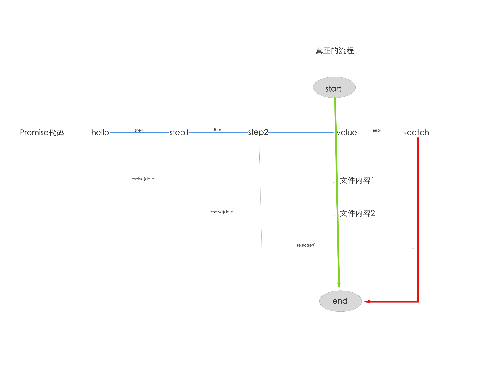
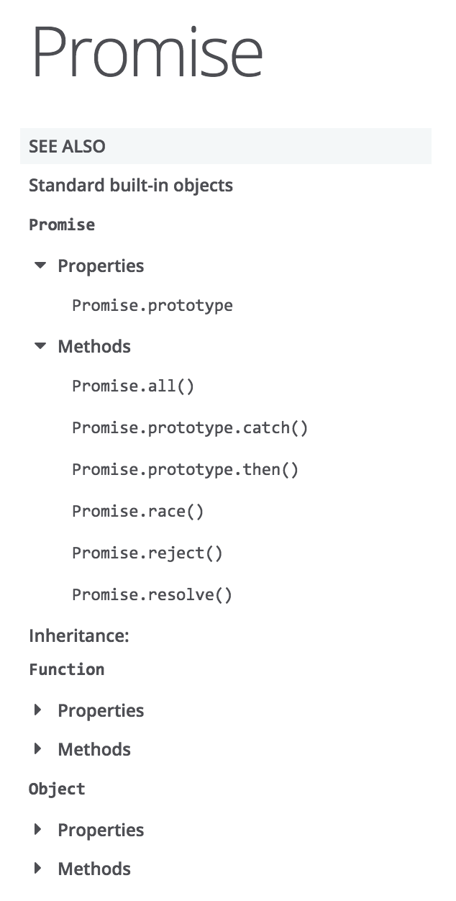
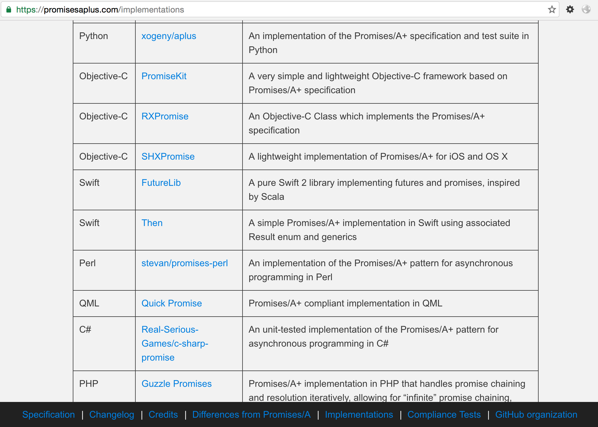

# Promise/a+规范

顺序执行的代码和错误有限的回调方式都是js引擎默认支持的，这部分大家会调用接口，无太多变化，而Promise是对callback的思考，或者说改良方案，目前使用非常普遍，这里详细讲解一下。

## Node.js里的Promise

promise最早是在commonjs社区提出来的，当时提出了很多规范。比较接受的是promise/A规范。后来人们在这个基础上。提出了promise/A+规范，也就是实际上的业内推行的规范。es6也是采用的这种规范。

> The Promise object is used for asynchronous computations. A Promise represents an operation that hasn't completed yet, but is expected in the future.

Promise对象用于异步技术中。Promise意味着一个还没有完成的操作（许愿），但在未来会完成的（实现）。


在Node.js 0.12里实现9/11，在6.2和7实现100%，中间版本实现了10/11。所以Node.js对Promise的支持是非常好的，0.12之后的绝大部分版本都支持的不错。

Promise 的最大优势是标准，各类异步工具库都认同，未来的 async/await 也基于它，用它封装 API 通用性强，用起来简单。

要想知道node.js有哪些比较好的promise实现，最好的办法就是看一下最知名的bluebird库的[benchmark](http://bluebirdjs.com/docs/benchmarks.html)里比较里哪些。

- async@1.5.0
- babel@5.8.29
- davy@1.0.1
- deferred@0.7.3
- kew@0.7.0
- lie@3.0.1
- neo-async@1.6.0
- optimist@0.6.1
- promise@7.0.4
- q@1.4.1
- rsvp@3.1.0
- streamline@1.0.7
- text-table@0.2.0
- vow@0.4.11
- when@3.7.4


## Promise是什么？

> A promise is an abstraction for asynchronous programming. It’s an object that proxies for the return value or the exception thrown by a function that has to do some asynchronous processing. — Kris Kowal on JSJ

Promise表示一个异步操作的最终结果。与Promise最主要的交互方法是通过将函数传入它的then方法从而获取得Promise最终的值或Promise最终最拒绝（reject）的原因。

- 递归，每个异步操作返回的都是promise对象
- 状态机：三种状态转换，只在promise对象内部可以控制，外部不能改变状态
- 全局异常处理

定义

```
var promise = new Promise(function(resolve, reject) {
  // do a thing, possibly async, then…

  if (/* everything turned out fine */) {
    resolve("Stuff worked!");
  }
  else {
    reject(Error("It broke"));
  }
});
```

## 术语

- Promises	Promise规范自身
- promise对象	promise对象指的是 Promise 实例对象
- ES6 Promises	如果想明确表示使用 ECMAScript 6th Edition 的话，可以使用ES6作为前缀（prefix）
- Promises/A+	Promises/A+。 这是ES6 Promises的前身，是一个社区规范，它和 ES6 Promises 有很多共通的内容。
- Thenable	类Promise对象。 拥有名为.then方法的对象。

## hello promise

给出一个最简单的读写文件的api实例，它是error-first风格的典型api

async/promise/hello.js

```
// callbacks
var fs = require("fs");

fs.readFile('./package.json', (err, data) => {
  if (err) throw err;
  console.log(data.toString());
});

```

下面，我们把它变成promise的简单示例

async/promise/hellopromise.js

```
// callbacks to promise
var fs = require("fs");

function hello (file) {
  return new Promise(function(resolve, reject){
    fs.readFile(file, (err, data) => {
    	if (err) {
    		reject(err);
    	} else {
    		resolve(data.toString())
    	}
    });
  });
}

hello('./package.json').then(function(data){
  console.log('promise result = ' + data)
}).catch(function(err) {
  console.log(err)
})

```

这二段代码执行效果是一模一样的，唯一的差别是前一种写法是Node.js默认api写法，以回调为主，而后一种写法，通过返回promise对象，在fs.readFile的回调函数，将结果延后处理。

这就是最简单的promise实现


形式

```
new Promise(function(resolve, reject){
  
})
```

参数

- resolve 解决，进入到下一个流程
- reject  拒绝，跳转到捕获异常流程

调用

```
hello('./package.json').then(function(data){

})
```

全局处理异常

```
hello('./package.json').then(function(data){

}).catch(function(err) {

})
```

结论

> Promise核心：将callback里的结果延后到then函数里处理或交给全局异常处理


## 封装api的过程

还是以上面的fs.readFile为例

```
fs.readFile('./package.json', (err, data) => {
  if (err) throw err;
  console.log(data.toString());
});
```

参数处理：除了callback外，其他东西都放到新的函数的参数里

```
function hello (file) {
  ...
}
```

返回值处理：返回Promise实例对象

```
function hello (file) {
  return new Promise(function(resolve, reject){
    ...
  });
}
```

结果处理：通过resolve和reject重塑流程

```
function hello (file) {
  return new Promise(function(resolve, reject){
    fs.readFile(file, (err, data) => {
    	if (err) {
    		reject(err);
    	} else {
    		resolve(data.toString())
    	}
    });
  });
}
```

我们知道所有的Node.js都是error-first的callback形式，通过上面的例子，我们可以肯定是所有的Node.js的API都可以这样来处理，只要它们遵守Promise规范即可。

## 每个函数的返回值都是Promise对象

为了简化编程复杂性，每个函数的返回值都是Promise对象，这样的约定可以大大的简化编程的复杂。

它可以理解为是递归的变种思想应用，只要是Promise对象，就可以控制状态，就可以支持then方法，参数还是Promise对象，这样就可以无限个Promise对象链接在一起。

```
// callbacks to promise
var fs = require("fs");

function hello (file) {
  return new Promise(function(resolve, reject){
    fs.readFile(file, (err, data) => {
    	if (err) {
    		reject(err);
    	} else {
    		resolve(data.toString())
    	}
    });
  });
}

function world (file) {
  return new Promise(function(resolve, reject){
    fs.readFile(file, (err, data) => {
    	if (err) {
    		reject(err);
    	} else {
    		resolve(data.toString())
    	}
    });
  });
}

function log(data){
  return new Promise(function(resolve, reject){
    console.log('promise result = ' + data)
    resolve(data)
  });
}

hello('./package.json').then(log).then(function(){
  return world('./each.js').then(log)
}).catch(function(err) {
  console.log(err)
})

```

这里可以看出

- `hello`、`world`、`log` 返回单个Promise对象
- `hello('./each.js').then(log)` 返回流程链

无论是单个，还是流程链的返回值都是Promise对象，那么它就是一样的。

## 链式的thenable

每个promose对象都有then方法，也就是说，then方法是定义在原型对象Promise.prototype上的。它的作用是为Promise实例添加状态改变时的回调函数。

一般实现，类似于

```
Promise.prototype.then = function(sucess, fail) {
    this.done(sucess);
    this.fail(fail);
    return this;
};
```

它的返回值是this，这就是为什么then可以链式操作的原因。

then的2个参数

- sucess是fulfilled状态的回调函数
- fail是rejected状态的回调函数

一般都是穿sucess回调函数即可。

## 状态转换

一个Promise必须处在其中之一的状态：pending, fulfilled 或 rejected.

- pending: 初始状态, 非 fulfilled 或 rejected.
- fulfilled: 完成（成功）的操作.
- rejected: 拒绝（失败）的操作.

这里从pending状态可以切换到fulfill状态，也可以从pengding切换到reject状态，这个状态切换不可逆，且fulfilled和reject两个状态之间是不能互相切换的。

一定要注意的是，只有异步操作的结果，才可以决定当前是哪一种状态，任何其他操作都无法改变这个状态。

Promise对象可以理解为一个乐高积木，它对下一个流程，传送状态和具体结果。


如果是pending状态,则promise：

  - 可以转换到fulfilled或rejected状态。
  
如果是fulfilled状态,则promise：

  - 不能转换成任何其它状态。
  - 必须有一个值，且这个值不能被改变。

如果是rejected状态,则promise可以：

  - 不能转换成任何其它状态。
  - 必须有一个原因，且这个值不能被改变。
  
”值不能被改变”指的是其identity不能被改变，而不是指其成员内容不能被改变。

## reject和resove流程再造

前面讲了，每个函数的返回值都是Promise对象，每个Promise对象都有then方法，这是它可以递归思路的解决办法。

那么问题来了，如何在连续的操作步骤里，完成流程再造呢？这其实才是异步流程控制最核心的问题。

我们知道Promise的使用形式如下：

```
new Promise(function(resolve, reject){
  
})
```

下面仍然使用fs的例子，见reflow.js

`way 1`：简单模式

```
hello('./package.json').then(function(data){
  console.log('way 1:\n')
  return new Promise(function(resolve, reject){
    console.log('promise result = ' + data)
    resolve(data)
  });
}).then(function(data){
  return new Promise(function(resolve, reject){
    resolve('1')
  });
}).then(function(data){
  console.log(data)
  
  return new Promise(function(resolve, reject){
    reject(new Error('reject with custom err'))
  });
}).catch(function(err) {
  console.log(err)
})

```

这是一个常规的例子，就是在then里面的promise对象里，通过resolve将流程进行到下一步，在reject的时候抛出异常。这里面的每一个promise对象里都可以这样做，那么是不是这个操作流程就是可控的了？

`way 2`：嵌套模式

```
hello('./package.json').then(function(data){
  console.log('\n\nway 2:\n')
  return new Promise(function(resolve, reject){
    console.log('promise result = ' + data)
    resolve(data)
  }).then(function(data){
    return new Promise(function(resolve, reject){
      resolve('1')
    });
  }).catch(function(err) {
    console.log(err)
  })
}).then(function(data){
  console.log(data)
  
  return new Promise(function(resolve, reject){
    reject(new Error('reject with custom err'))
  });
}).catch(function(err) {
  console.log(err)
})
```

这里的做法是，把第一个then和第二个then合并到一个流程里。这样做的好处是，这个流程也可以考虑单独处理异常。为了某些粒度更新的异步处理，是非常有好处的。


`way 3`：嵌套模式的refact清晰版

```
var step1 = function(data){
  console.log('\n\nway 3:\n')
  return new Promise(function(resolve, reject){
    console.log('promise result = ' + data)
    resolve(data)
  }).then(function(data){
    return new Promise(function(resolve, reject){
      resolve('1')
    });
  }).catch(function(err) {
    console.log(err)
  })
}

var step2 = function(data){
  console.log(data)
  
  return new Promise(function(resolve, reject){
    reject(new Error('reject with custom err'))
  });
}

hello('./package.json').then(step1).then(step2).catch(function(err) {
  console.log(err)
})
```

把每个独立的操作抽成函数，然后函数的返回值是Promise对象，这样就可以在真正的流程链里随意组织了。

它们就好比是积木一样，可以让逻辑更清楚，让代码更具可读性和可维护性。如果再极端点，每个操作都放到独立文件里，变成模块，是不是更爽呢？  


`way 4`：final版，把每个独立的操作放到独立文件里，变成模块

原理: 使用`require-directory`

根据commonjs规范，require只能引用某一个文件，当一个文件夹里有很多文件，每一个都去require是很麻烦的，`require-directory`就是一个便捷模块，可以把某个文件夹内的多个文件挂载到一个对象。

原理，递归遍历文件，读取具体文件，如果是遵循commonjs规范的模块，就挂载在它的返回值对象上。

比如reflow/tasks/index.js

```
var requireDirectory = require('require-directory');
module.exports = requireDirectory(module);
```

这样`reflow/tasks`下的所有遵循commonjs规范的模块都可以挂载

reflow/tasks/hello.js

```
var fs = require("fs");

module.exports = function hello (file) {
  return new Promise(function(resolve, reject){
    fs.readFile(file, (err, data) => {
    	if (err) {
    		reject(err);
    	} else {
    		resolve(data.toString())
    	}
    });
  });
}
```

这其实和之前的定义是一模一样的，唯一差别就是变成了模块，使用了module.exports来导出。

其他的step1和step2以此类推，下面我们卡一下具体调用的代码

```
var tasks = require('./tasks')

tasks.hello('./package.json').then(tasks.step1).then(tasks.step2).catch(function(err) {
  console.log(err)
})
```

给出具体的流程图




首先`require('./tasks')`获得tasks目录下的所有操作任务定义，然后在下面的Promise流程里处理，可以看出定义和实现分离，让代码有更好的可读性。

如果，这时我们恰好需要调整step1和step2的顺序，是不是非常的简单？

```
var tasks = require('./tasks')

tasks.hello('./package.json').then(tasks.step2).then(tasks.step1).catch(function(err) {
  console.log(err)
})
```

更多好处，自行体会吧，这里就不做更多解释了。

## 错误处理

常用的处理方式是全局处理，即所有的异步操作都由一个catch来处理

```
promise.then(function(result) {
  console.log('Got data!', result);
}).catch(function(error) {
  console.log('Error occurred!', error);
});
```

当然，then方法的第二个参数也是可以的

```
promise.then(function(result) {
  console.log('Got data!', result);
}).then(undefined, function(error) {
  console.log('Error occurred!', error);
});
```

如果有多个then配对的reject函数呢？是不是可以更加灵活？这其实就要取决于你的业务复杂程度里。

错误处理最简单的办法是在promise里使用try/catch的语句。在try/catch块中，它可能去捕获异常，并显示处理它：（TODO: 重写个更简单例子）

```
try {
  throw new Error('never will know this happened')
} catch (e) {}
```

在promises里可以这样写

```
readFile()
  .then(function (data) {
    throw new Error('never will know this happened')
  })
```

为了打印errors，这里以简单的.then(null, onRejected)语句为例

```
readFile()
  .then(function (data) {
    throw new Error('now I know this happened')
  })
  .then(null, console.error)
```

类库包括一些暴露error的其他选项。比如Q就提供了done方法，可以再次跑出error异常的。


链式写法很方便，可以随意组合，

api/catch.js

```
var p1 = new Promise(function(resolve, reject) {
  resolve('Success');
});

p1.then(function(value) {
  console.log(value); // "Success!"
  return Promise.reject('oh, no!');
}).catch(function(e) {
  console.log(e); // "oh, no!"
  // return Promise.reject('oh, no! 2');
}).then(function(){
  console.log('after a catch the chain is restored');
}, function () {
  console.log('Not fired due to the catch');
});
```

执行

```
$ node api/catch.js
Success
oh, no!
after a catch the chain is restored
```

api/catch2.js
 
```
var p1 = new Promise(function(resolve, reject) {
  resolve('Success');
});

p1.then(function(value) {
  console.log(value); // "Success!"
  return Promise.reject('oh, no!');
}).catch(function(e) {
  console.log(e); // "oh, no!"
  return Promise.reject('oh, no! 2');
}).then(function(){
  console.log('after a catch the chain is restored');
}, function () {
  console.log('Not fired due to the catch');
});
```

执行

```
$ node api/catch2.js
Success
oh, no!
Not fired due to the catch
```

## Promise的5个api



1）构造方法

语法

> new Promise( /* executor */ function(resolve, reject) { ... } );

所有Promise只能这样创建，它的2个参数resolve和reject是唯一可以改变对象状态的方法。

- resolve会让状态从pending切换到fulfilled
- reject会让状态从pending切换到rejected（可选，不写也不算错）
  - Promise.prototype.then()可以当前操作的reject异常
  - Promise.prototype.catch()可以捕获全局的reject异常

备注：这里的resolve相当于Promise.resolve的别名，reject相当于Promise.reject的别名。

promise/api/a.js

```
new Promise(function(resolve){
    resolve(1);
}).then(function(value){
    console.log('new Promise ' + value);
});

Promise.resolve(1).then(function(value){
    console.log('Promise.resolve ' + value);
});

```

这2个示例resolve效果是一样的，可以看出Promise.resolve是便捷用法

promise/api/b.js

```
var error = new Error('this is a error')

new Promise(function(resolve, reject){
    reject(error);
}).catch(function(err){
    console.log('new Promise ' + err);
});

Promise.reject(error).catch(function(err){
    console.log('Promise.resolve ' + err);
});

```

这2个示例reject效果是一样的，可以看出Promise.reject是便捷用法


既然resolve和reject都有别名，那么我们能不能不适用构造函数，直接使用便捷用法呢？答案是不可以的，具体如下，见promise/api/c.js

```
// 以下做法是错误的
new Promise(function(){
    return Promise.resolve(1)
}).then(function(value){
    console.log('Promise.resolve 1 ' + value);
});

```

可能有的库会实现，但Node.js的原生Promise是不支持这样的写法的。

想便捷的话，一般采用下面这样的方法

promise/api/d.js

```
// 以下做法是正确的的
function hello(i){
    return Promise.resolve(i)
}

hello(1).then(function(value){
    console.log('Promise.resolve 1 ' + value);
});
```

这种写法可行原因是，Promise.resolve返回的是Promise对象，相当于`new Promise(resolve, reject)`

但是一定要注意，一旦的函数确定要返回Promise对象，就一定要全部可能分支都要返回Promise对象，不然出了问题非常难定位。

举个简单的例子，i是奇数或偶数做不一样的处理，一定要严谨。

promise/api/e.js

```
// 奇数和偶数
function hello(i){
  if (i % 2 == 0) {
    return Promise.resolve(i)
  } else {
    return Promise.reject(i)
  }
}

hello(1).then(function(value){
    console.log('Promise.reject 1 ' + value);
});

hello(2).then(function(value){
    console.log('Promise.resolve 1 ' + value);
});
```

其实按照规范Promise.resolve和Promise.reject还有更多用法，其他的给出语法定义，了解一下即可，没有特别需要说明的。

> Promise.resolve(value);
> Promise.resolve(promise);
> Promise.resolve(thenable);
> 
> Promise.reject(reason);

2）核心方法Promise.prototype.then()

语法

> p.then(onFulfilled, onRejected);
> 
> p.then(function(value) {
>    // fulfillment
>   }, function(reason) {
>   // rejection
> });

3）次核心方法Promise.prototype.catch()

> p.catch(onRejected);
> 
> p.catch(function(reason) {
>    // rejection
> });


4）工具方法

- Promise.all(iterable)
- Promise.race(iterable)

Promise.all 在接收到的所有的对象promise都变为 FulFilled 或者 Rejected 状态之后才会继续进行后面的处理， 与之相对的是 Promise.race 只要有一个promise对象进入 FulFilled 或者 Rejected 状态的话，就会继续进行后面的处理。

简单点就说，all是所有都执行完成，再执行then，而race语义上相当于once，有个执行完成后就会执行then。一定要注意，它们是并发的，只是结果处理的点不一样而已。

它们的使用方法是一样，接收一个promise对象数组为参数。

all.js

```
'use strict'

let sleep = (time, info) => {
  return new Promise(function (resolve) {
    setTimeout(function () {
        console.log(info)
        resolve('this is ' + info)
    }, time)
  })
}

let loser = sleep(1000, 'loser')
let winner = sleep(4, 'winner')

// main
Promise.all([winner, loser]).then(value => {
    console.log("所有都完成后会执行then，它们是并行的哦: " + value)    // => 'this is winner'
})

```

执行结果

```
$ node api/all.js 
winner
loser
所有都完成后会执行then，它们是并行的哦: this is winner,this is loser
```

race.js

```
'use strict'

let sleep = (time, info) => {
  return new Promise(function (resolve) {
    setTimeout(function () {
        console.log(info)
        resolve('this is ' + info)
    }, time)
  })
}

let loser = sleep(1000, 'loser')
let winner = sleep(4, 'winner')

// main
Promise.race([winner, loser]).then(value => {
    console.log("只要有一个成功，就会执行then，和顺序无关，只看执行速度: " + value)    // => 'this is winner'
})
```

执行结果

```
$ node api/race.js
winner
只要有一个成功，就会执行then，和顺序无关，只看执行速度: this is winner
loser
```

## Promise/a+只有Node.js有么？

这是大家经常问到的问题，明确的说，promise/a+是规范。

而Node.js因为完全异步，导致callbackhell，所以是所有语言里比较早引入Promise/a+规范的，是Promise/a+规范的经典实现。

其他语言也有类似实现的，比如oc，java，ruby等

https://promisesaplus.com/implementations

