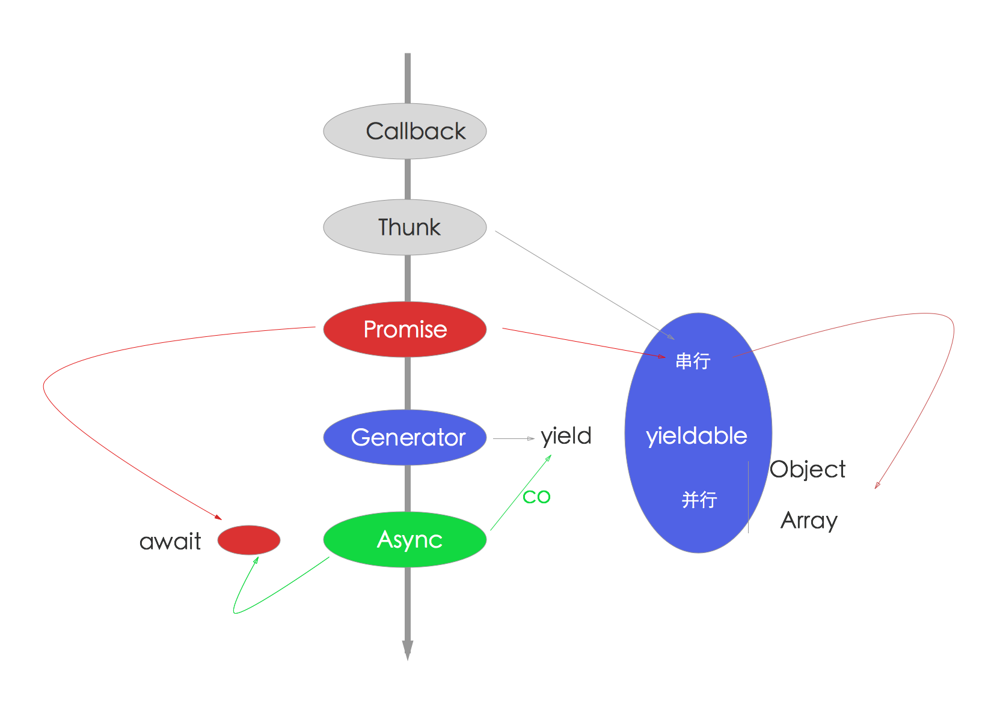
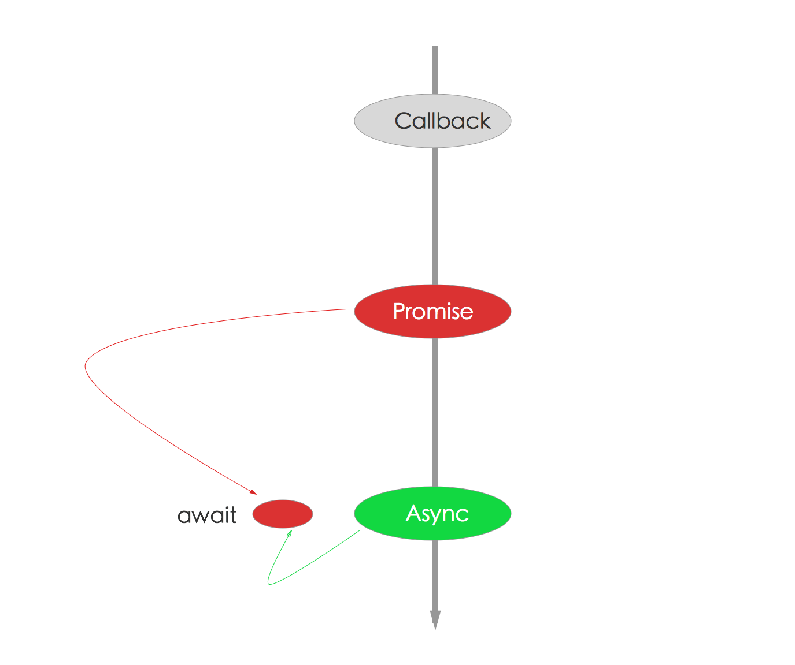

# 学习重点

综上所述

- Async函数是趋势，如果Chrome 52. v8 5.1已经支持Async函数(https://github.com/nodejs/CTC/issues/7)了，Node.js支持还会远么？
- Async和Generator函数里都支持promise，所以promise是必须会的。
- Generator和yield异常强大，不过不会成为主流，所以学会基本用法和promise就好了，没必要所有的都必须会。
- co作为Generator执行器是不错的，它更好的是当做Promise 包装器，通过Generator支持yieldable，最后返回Promise，是不是有点无耻？

我整理了一张图，更直观一些。

- 红色代表Promise，是使用最多的，无论async还是generator都可用
- 蓝色是Generator，过度货
- 绿色是Async函数，趋势

**结论**：Promise是必须会的，那你为什么不顺势而为呢？

**推荐**：使用Async函数 + Promise组合，如下图所示。

**实践**

合理的结合Promise和Async函数是可以非常高效的，但也要因场景而异

- Promise更容易做promisefyAll（比如使用bluebird）
- Async函数无法批量操作

那么，在常见的Web应用里，我们总结的实践是，dao层使用Promise比较好，而service层，使用Async/Await更好。

dao层使用Promise：

- crud
- 单一模型的方法多
- 库自身支持Promise

这种用promisefyAll基本几行代码就够了，一般单一模型的操作，不会特别复杂，应变的需求基本不大。

而service层一般是多个Model组合操作，多模型操作就可以拆分成多个小的操作，然后使用Await来组合，看起来会更加清晰，另外对需求应变也是非常容易的。
