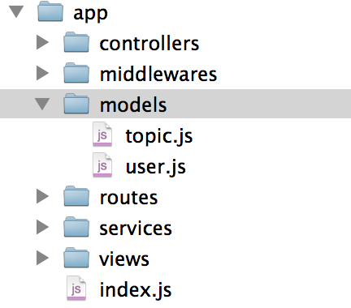

# 什么时候会用到异步流程控制

主要讲2个场景

- 数据库
- 工具类：比如爬虫

## 数据库

一般说crud指的是增删改查，也可以指对某个表的增删改查。

所以有一个概念叫dao（data access object），一般会先定义entity实体，然后定义该entity的dao。但大部分业务逻辑里，一个表的操作是不够的。

然后有个一service层的概念，即组装多个dao来完成某一业务逻辑，成为service（不要和rpc服务的服务混了）。

一般目录

举例：发帖完成后，更新用户的发帖数

- step 1：发帖
- step 2：更新用户的发帖数

更复杂的业务可能要几十个表甚至上百个表来完成。所以，类似的有先后顺序的多个步骤的流程都需要使用异步流程控制

## 工具类：比如爬虫

爬取一本书的流程

- 先取列表
- 再去章节

技能

- node-crawler 爬取，发送http请求，是基于request模块的
- 结合jsdom，使用类似于jquery的dom操作，解析结果

node-crawler有2种用法

- c.queue方法如无callback，走全局的callback，这是获取列表的时候的用法
- c.queue方法如有callback，走自己的callback，这是获取章节的用法

我们的做法

- 最小化问题，先关注爬取一本书的流程
- 爬取一本书的流程中的列表
- 爬取一本书的流程中的章节

在这个过程中，我们可以很好的学习node-crawler和jquery的dom操作，知识点整体来说比较少，更加容易学习。

那么，我们想想，如果不是遍历直接函数调用解决，该怎么做呢？

比如一本书有10章，爬完第一章，才能爬第二章，以此类推
