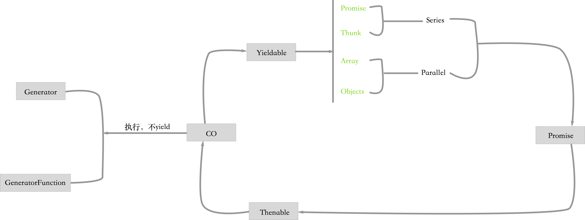

# 5种 yieldable

yieldable本来是没有这个词的，因为在Generator里可以是yield关键词，而yield后面接的有5种可能，故而把这些可以yield接的方式成为yieldable，即可以yield接的。

- Promises
- Thunks (functions)
- array (parallel execution)
- objects (parallel execution)
- Generators and GeneratorFunctions

这里我把co和promise做了简单的关键，同时区分Yieldable里的并行和顺序执行处理方式，以便大家能够更好的理解co和Yieldable。

- 顺序执行
  - Promises
  - Thunks
- 并行
  - array
  - objects

无论是哪种，它们其实都可以是Promise，而既然是Thunk对象，它们就可以thenable，而co v4.6版本的执行的返回值就是Promise，至此完成了左侧闭环。

至于Generator和GeneratorFunction就要从yield和yield*讲起，在koa 1.x和2.x里有明显的应用。

最关键的是，Generator是用来计算的迭代器，它是过渡性的产物。yiedable足够强大，只是学习成本稍高，理解起来也有些难度。
