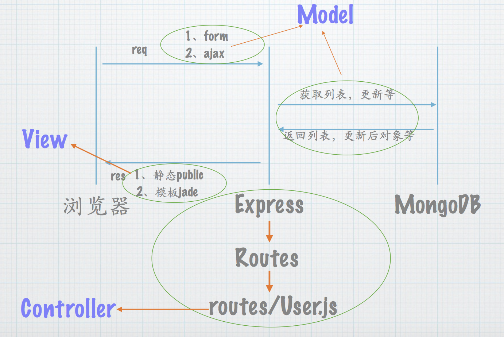
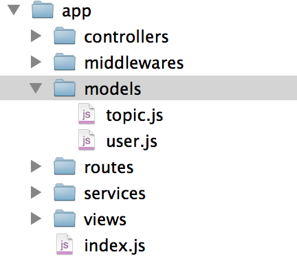

# 了解mvc里m（model）的作用

在当下流行的MEAN架构里，M 指的是 mongodb，即
 
## 模型说明

这里我们可以看出controller实际是和mongodb访问，完成业务逻辑，然后返回给浏览器响应。所以核心的数据存取都在mongodb这里，这实际上也是三层架构里的数据访问层的位置。

## 代码结构

那么我们在代码里会如何使用呢？

## 总结

了解了model的作用之后，我们就知道在代码如何编写，如何去测试，这是本小节的目的，接下来，我们会花费很大篇幅去讲mongoose的用法，整体会以user为例，展示所有的mongoose特性。
