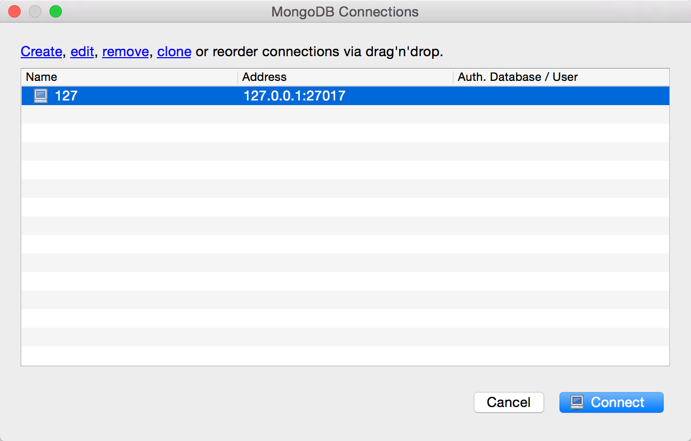
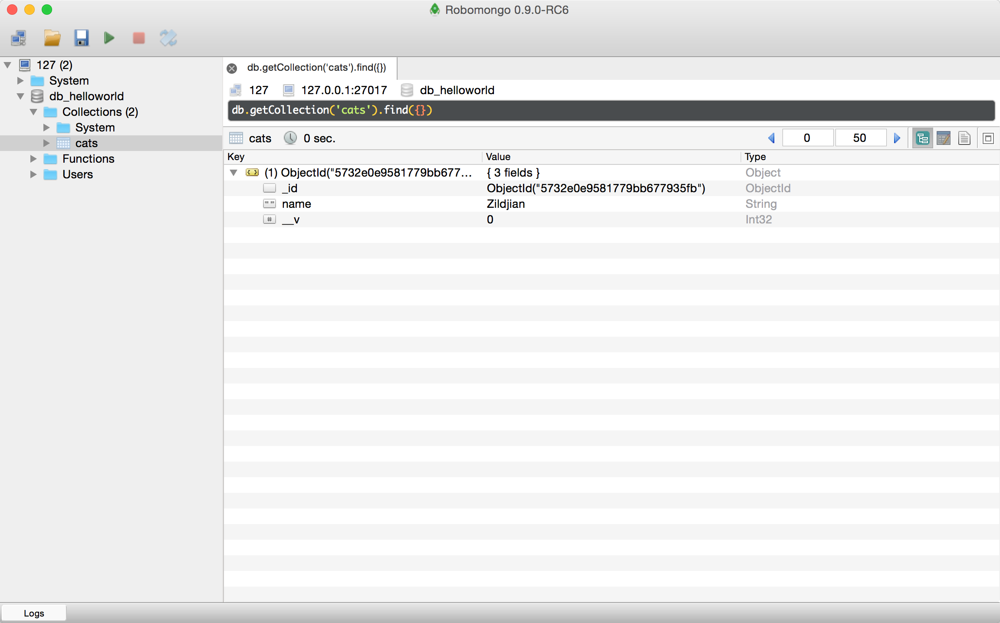

# mongoose入门

MongoDB是一个开源的NoSQL数据库，相比MySQL那样的关系型数据库，它更显得轻巧、灵活，非常适合在数据规模很大、事务性不强的场合下使用。同时它也是一个对象数据库，没有表、行等概念，也没有固定的模式和结构，所有的数据以文档的形式存储(文档，就是一个关联数组式的对象，它的内部由属性组成，一个属性对应的值可能是一个数、字符串、日期、数组，甚至是一个嵌套的文档。)，数据格式就是JSON。

假定读者已经了解了mongdb和mysql的区别和为什么选用mongodb，继而介绍nodejs里的mongoose模块进行实战，具体分4步骤

- mongoose是什么？
- mongoose入门
- mongoose概念
- mongoose crud

## Mongoose是什么？

Mongoose是MongoDB的一个对象模型工具，是基于node-mongodb-native开发的MongoDB nodejs驱动，可以在异步的环境下执行。同时它也是针对MongoDB操作的一个对象模型库，封装了MongoDB对文档的的一些增删改查等常用方法，让NodeJS操作Mongodb数据库变得更加灵活简单。

Mongoose，因为封装了对MongoDB对文档操作的常用处理方法，可以高效的操作mongodb,同时可以理解mongoose是一个简易版的orm ，提供了类似schema定义，hook、plugin、virtual、populate等机制，让NodeJS操作Mongodb数据库变得特别简单!

以往书中往往直接上例子，混合各种库和代码，容易让人晕，必须在例子中才能知道m是如何使用的，我一直认为这是不合理的，为什么我要掌握其他的知识才能学mongoose？

其实，它也仅仅是一个node模块而已。

官网：http://mongoosejs.com/

## mongoose入门

前面我们已经认识了Mongoose，也了解了MongoDB，回顾一下：MongoDB是一个对象数据库，是用来存储数据的；Mongoose是封装了MongoDB操作的一个对象模型库,是用来操作这些数据的。

好，下面我们就来进行操作数据的第一步吧。

### 准备

1、 安装mongoose

```
$ npm install --save mongoose
```

2、 引用mongoose

```
var mongoose = require("mongoose");
```

3、 使用"mongoose"连接数据库

```
var db = mongoose.connect("mongodb://user:pass@ip:port/database");
```

说明

- user 是mongodb里用户名
- pass 是mongodb里用户对应的密码
- ip   是mongodb服务器可以访问`ip`地址，比如本地为`127.0.0.1`
- port 是mongodb服务器可以访问端口，默认是`27017`

### 测试

执行下面代码检查默认数据库test，是否可以正常连接成功?

```
var mongoose = require("mongoose");

var db = mongoose.connect("mongodb://127.0.0.1:27017/db_helloworld"); 

db.connection.on("error", function (error) {  
  console.log("数据库连接失败：" + error); 
}); 

db.connection.on("open", function () {  
  console.log("数据库连接成功"); 
});
```

执行代码

```
$ node book-source/db/helloworld/connect.js
数据库连接成功
```

当mongodb没有启动的时候会报错，当出现如下问题，请执行`mhg`启动mongodb即可

```
$ node book-source/db/helloworld/connect.js
数据库连接失败：MongoError: connect ECONNREFUSED 127.0.0.1:27017
```

### 最小demo

这里给出极简demo，用于讲解mongoose从连接数据库到对数据库进行操作完整过程，这样更容易让读者了解核心原理，代码如下：

```
// 1、引入`mongoose`模块
var mongoose = require('mongoose');

// 2、通过`mongoose.connect`连接mongodb数据库
mongoose.connect('mongodb://127.0.0.1/db_helloworld');

// 3、通过`mongoose.model`定义模型(model)
var Cat = mongoose.model('Cat', { name: String });

// 4、通过`new`关键字实例化Cat模型，参数是`{ name: 'Zildjian' }`，创建kitty对象
var kitty = new Cat({ name: 'Zildjian' });

// 5、执行`kitty.save`来保存到数据库
kitty.save(function (err) {
  if (err) {
    console.log('save error:' + err);
  }
  
  console.log('save sucess');
});
```

核心步骤说明

- 定义模型(model)
- 通过`new`关键字实例化Cat模型，创建kitty对象
- 执行`kitty.save`来保存到数据库

这个其实就是mongoose最常见的用法，首先约定schema，即在模型model定义的时候指定字段和字段类型，避免乱用schema-free问题。之后对实例化模型创建的对象进行操作，完成我们常见的增删改查功能。

```
模型(model)定义即定义对象，对象操作即对数据库进行操作
```

执行如下

```
$ node book-source/db/helloworld/helloworld.js
```

如无错误日志，即代表数据保存成功。此时打开robo mongodb客户端查看一下具体数据是否保存成功。

创建robo客户端连接




查看cat数据



如果有`{ name: 'Zildjian' }`记录的，即为正常。


## 实例

- 连接数据库信息放到独立文件里
- 模型定义放到独立文件
- 在具体调用的文件里，使用模型定义

### 连接数据库

看一下实际代码，`db/mini/connect.js`

```
var mongoose = require("mongoose");

var db = mongoose.connect("mongodb://127.0.0.1:27017/db_helloworld"); 

db.connection.on("error", function (error) {  
  console.log("数据库连接失败：" + error); 
}); 

db.connection.on("open", function () {  
  console.log("数据库连接成功");
});
```

一般项目里，所有模型都共用一个数据库连接信息，所以把连接数据库的代码抽取到`connect.js`里，然后在对应的模型里会app入口引用即可。

### 模型定义

看一下实际模型定义代码，`db/mini/user.js`

```
var mongoose = require('mongoose');

// 定义Schema
UserSchema = new mongoose.Schema({
  username: {// 真实姓名
    type: String,
    required: true
  },
  password: { // 密码
    type: String,
    required: true
  }
});

// 定义Model
var UserModel = mongoose.model('User', UserSchema);

// 暴露接口
module.exports = UserModel;
```

这是MVC里Model层最长见的代码，没有连接信息，也没有其他额外不相干代码，当你看到`user.js`你就能理解它在数据库里对应的表结构，以及字段的类型、约束等信息，一般来说，代码写的越干净，可读性会更好一些。

这里定义的User模型里只有 `用户名` 和 `密码` 2个字段，它们都必须有值的，也就是说当你创建用户的时候，没有密码或者没有用户名你是无法创建成功的。

### 测试代码

看一下实际代码`db/mini/test.js`

```
// 1、引入`mongoose connect`
require('./connect');

// 2、引入`User` Model
var User = require('./user');

// 3、定义`user` Entity
var user = new User({
  username: 'i5ting',
  password: '0123456789'
});

// 4、对数据库进行操作
user.save(function(err, doc){
  if (err) {
    console.log('save error:' + err);
  }
  
  console.log('save sucess \n' + doc);
})
```

核心步骤

- 引入数据库连接，保证mongodb已经连接成功
- 引入模型（model）定义文件，即文档（表）结构定义
- 实例化UserModel，创建user实体
- 最后通过user实体对数据库进行操作，完成用户注册功能。

这是项目里数据访问层的代码，它真实的对数据库进行操作，所以它一般会出现在`controller`或`service`层。

### 执行测试

```
$ node db/mini/test.js 
数据库连接成功
save sucess 
{ _id: 57341fc54d97ee0249082a1d,
  password: '0123456789',
  username: 'i5ting',
  __v: 0 }
```


## 概念

结合上面的实例来讲4个核心概念，以便于理解

- ORM 对象关系映射
- Schema
- Model 模型
- Entity 实体

## 对象关系映射

对象关系映射（英语：Object Relational Mapping，简称ORM，或O/RM，或O/R mapping），是一种程序设计技术，用于实现面向对象编程语言里不同类型系统的数据之间的转换。从效果上说，它其实是创建了一个可在编程语言里使用的“虚拟对象数据库”。如今已有很多免费和收费的ORM产品，而有些程序员更倾向于创建自己的ORM工具。

面向对象是从软件工程基本原则（如耦合、聚合、封装）的基础上发展起来的，而关系数据库则是从数学理论发展而来的，两套理论存在显著的区别。为了解决这个不匹配的现象，对象关系映射技术应运而生。

对象关系映射（Object-Relational Mapping）提供了概念性的、易于理解的模型化数据的方法。

ORM方法论基于三个核心原则：

- 简单：以最基本的形式建模数据。
- 传达性：数据库结构被任何人都能理解的语言文档化。 
- 精确性：基于数据模型创建正确标准化的结构。 

典型地，建模者通过收集来自那些熟悉应用程序但不熟练的数据建模者的人的信息开发信息模型。建模者必须能够用非技术企业专家可以理解的术语在概念层次上与数据结构进行通讯。建模者也必须能以简单的单元分析信息，对样本数据进行处理。ORM专门被设计为改进这种联系。

让我们从O/R开始。字母O起源于 对象(OBJECT),而R则来自于 关系(RELATIONAL)。几乎所有的程序里面，都存在对象和关系数据库。在业务逻辑层和用户界面层中，我们是面向对象的。当对象信息发生变化的时候，我们需要把对象的信息保存在关系数据库中。

最简单的理解：

```
ORM是让用语言中的对象来操作数据库，至于如何实现就是orm工具实现的，可以理解mongoose是orm工具。
```

mongoose包括以下四部分：

- 一个对持久类对象进行CRUD操作的API，可以理解为实体Entity上的方法
- 一个语言或API用来规定与类和类属性相关的查询，比如Population
- 一个规定MAPPING METADATA的工具，可以理解为Schema定义
- 一种技术可以让ORM的实现各种db操作的封装

## Schema

Everything in Mongoose starts with a Schema. Each schema maps to a MongoDB collection and defines the shape of the documents within that collection.

Schema是一种以文件形式存储的数据库模型骨架，无法直接通往数据库端，也就是说它不具备对数据库的操作能力，仅仅只是定义数据库模型在程序片段中的一种表现，可以说是数据属性模型(传统意义的表结构)，又或着是“集合”的模型骨架。

最简单的理解：

```
Schema是对文档(表)结构的定义
```

那如何去定义一个Schema呢，请看示例：

```
// 定义Schema
UserSchema = new mongoose.Schema({
  username: {// 真实姓名
    type: String,
    required: true
  },
  password: { // 密码
    type: String,
    required: true
  }
});
```

基本属性类型有：字符串、日期型、数值型、布尔型(Boolean)、null、数组、内嵌文档等，当然它还有更丰富的对字段进行校验约束的功能。

## 模型(Model)

Models are fancy constructors compiled from our Schema definitions. Instances of these models represent documents which can be saved and retrieved from our database. All document creation and retrieval from the database is handled by these models.

模型(Model)是由Schema构造生成的模型，除了Schema定义的数据库骨架以外，还具有数据库操作的行为，类似于管理数据库属性、行为的类。

如何通过Schema来创建Model呢，如下示例：

```
var db = mongoose.connect("mongodb://127.0.0.1:27017/test");  
// 创建Model 
var TestModel = db.model("test1", TestSchema);


// 定义Model
var UserModel = mongoose.model('User', UserSchema);
```

`User`是模型名称，它对应到mongodb里就是数据库中的集合名称，默认会转成复数，变为'users',当我们对其添加数据时如果`users`已经存在，则会保存到其目录下，如果未存在，则会创建users集合，然后在保存数据。

拥有了Model，我们也就拥有了操作数据库的金钥匙，在后面的内容中，我们就会学习使用Model来进行增删改查的具体操作，所以，一定要熟悉他的创建格式哟！

如果你想对某个集合有所作为，那就交给Model模型来处理吧，创建一个Model模型，我们需要指定：1.集合名称，2.集合的Schema结构对象，满足这两个条件，我们就会拥有一个操作数据库的金钥匙。

TODO：创建Model  vs 定义Model

## 实体(Entity)

Mongoose documents represent a one-to-one mapping to documents as stored in MongoDB. Each document is an instance of its Model.

实体(Entity)是由Model创建的实体，使用save方法保存数据，Model和Entity都有能影响数据库的操作，但Model比Entity更具操作性。

使用Model创建Entity，如下示例：

```
var user = new User({
  username: 'i5ting',
  password: '0123456789'
});

console.log(user.username); // i5ting 
console.log(user.password); //0123456789
```

创建成功之后，Schema属性就变成了Model和Entity的公共属性了。

### 总结

Schema是骨架，模型（model）是根据Schema创建的模板，也就是说Schema和Model是定义部分，而实体Entity是模型实例化后创建的对象，它才是真正对数据库进行操作的。

所以我们会把定义部分（Schema + model）和实体操作部分（Entity）分开，定义是不变的，而实体是对数据库进行操作，操作类是术语可变的，所以在mvc分层的时候model实际放的是定义部分，而在controller里使用的是实体操作部分的。

基于前面的内容，接下来我们就开始学习对数据的具体操作了，下面是关于一些基础数据的定义，相信对于你来说已经不陌生了，请在仔细温习一遍吧！

## CRUD（增删改查）

CRUD为数据库的最常见的4种基本操作，即增加(Create)、读取(Retrieve)(重新得到数据)、更新(Update)和删除(Delete)几个单词的首字母简写。主要被用在描述软件系统中数据库或者持久层的基本操作功能。

mongoose提供如下的crud方法

- save
- find | findOne
- update
- remove

下面我们使用user模型为例，给出具体例子


### 增加(Create)

文档

```
Model#save(product,)

@description Saves this document.

Parameters:

- product, <function(err, > Number)} [fn] optional callback

Returns:
    <Promise> Promise
```

具体代码

```
const user = new User({
  username: 'i5ting',
  password: '0123456789'
});

user.save((err, u) => {
    t.false(err);
    t.is(u.username, 'i5ting');
});
```

### 读取(Retrieve)


#### find：根据条件查询，返回的是数组

文档

```
Model.find(conditions, [fields], [options], [callback])

Finds documents

Parameters:

- conditions <Object>
- [fields] <Object> optional fields to select
- [options] <Object> optional
- [callback] <Function>

Returns:
    <Query>
```

代码

```
User.find({}, (err, docs) => {
    t.false(err);
    t.is(docs.length, 1);
    t.is(docs[0].username, 'i5ting');
});
```


#### findOne：根据条件查询，返回的是一条数据对象

文档

```
Model.findOne([conditions], [fields], [options], [callback])

Finds one document.

Parameters:

- [conditions] <Object>
- [fields] <Object> optional fields to select
- [options] <Object> optional
- [callback] <Function>

Returns:
    <Query>
```

代码

```
User.findOne({username: 'i5ting'}, (err, doc) => {
    t.false(err);
    t.is(doc.length, 1);
    t.is(doc.username, 'i5ting');
});
```


### 更新(Update)

#### findByIdAndUpdate：根据ID查找并更新

文档说明如下

```
Model.findByIdAndUpdate(id, [update], [options], [callback])

Issues a mongodb findAndModify update command by a documents id.

show code

Parameters:

- id <ObjectId, HexId> an ObjectId or string that can be cast to one.
- [update] <Object>
- [options] <Object>
- [callback] <Function>

Returns:

    <Query>

```

具体代码

```
 User.findByIdAndUpdate(u._id, {
    username: 'sang',
}, (err, user) => {
    t.false(err);
    t.is(user.username, 'sang');
});
```

#### findOneAndUpdate：根据查询条件查找并更新

```
Model.findOneAndUpdate([conditions], [update], [options], [callback])

Issues a mongodb findAndModify update command.

Parameters:

- [conditions] <Object>
- [update] <Object>
- [options] <Object>
- [callback] <Function>

Returns:
    <Query>
```

具体代码

```
User.findOneAndUpdate({
    username: 'i5ting for update 2',
}, {
    username: 'sang',
}, (err, user) => {
    t.false(err);
    t.is(user.username, 'sang');
});
```

#### update方法(需要整理)

```
Model.update(conditions, doc, [options], [callback])

Updates documents in the database without returning them.

Parameters:

- conditions <Object>
- doc <Object>
- [options] <Object>
- [callback] <Function>

Returns:
  <Query>
```

Examples:

```
MyModel.update({ age: { $gt: 18 } }, { oldEnough: true }, fn);
MyModel.update({ name: 'Tobi' }, { ferret: true }, { multi: true }, function (err, numberAffected, raw) {
  if (err) return handleError(err);
  console.log('The number of updated documents was %d', numberAffected);
  console.log('The raw response from Mongo was ', raw);
});
```

### 删除(Delete)

文档

```
Model.remove(conditions, [callback])

Removes documents from the collection.

Parameters:

- conditions <Object>
- [callback] <Function>

Returns:
    <Promise> Promise
```

代码

```
User.remove({username: 'i5ting for delete'}, (err, doc) => {
    t.false(err);
    t.is(doc.result.ok, 1);
    t.is(doc.result.n, 1);
});
```

### 执行测试

```
$ cd db
$ npm test

> koa-db@1.0.0 test /Users/sang/workspace/17koa/book-source/db
> ava crud -v


数据库连接成功
  ✔ #save()
  ✔ #find() return array
  ✔ #findById() return array
  ✔ #findOne() return user obj
  ✔ #remove()
  ✔ #findByIdAndUpdate()
  ✔ #findOneAndUpdate()

  6 tests passed

```

### 调试模式
   
调试模式是mongoose提供的一个非常实用的功能，用于查看mongoose模块对mongodb操作的日志，一般开发时会打开此功能，以便更好的了解和优化对mongodb的操作。

打开调试的核心代码是设置 `debug` 变量值为 `true` 即可

```
var mongoose = require("mongoose");

// 核心代码，是否开启测试
mongoose.set('debug', true);

var db = mongoose.connect("mongodb://127.0.0.1:27017/db_helloworld"); 

db.connection.on("error", function (error) {  
  console.log("数据库连接失败：" + error); 
}); 

db.connection.on("open", function () {  
  console.log("数据库连接成功");
});
```

执行测试如下

```
$ cd db
$ npm test

> koa-db@1.0.0 test /Users/sang/workspace/17koa/book-source/db
> ava crud -v


数据库连接成功
Mongoose: users.remove({}) {}  
  ✔ #save()
  ✔ #find() return array
  ✔ #findById() return array
  ✔ #findOne() return user obj
  ✔ #remove()
  ✔ #findByIdAndUpdate()
  ✔ #findOneAndUpdate()
Mongoose: users.insert({ username: 'i5ting', password: '0123456789', _id: ObjectId("5734490640caa6d36906b8d4"), __v: 0 })   
Mongoose: users.find({}) { fields: undefined }  
Mongoose: users.findOne({ username: 'i5ting' }) { fields: undefined }  
Mongoose: users.insert({ username: 'i5ting for delete', password: '0123456789', _id: ObjectId("5734490640caa6d36906b8d5"), __v: 0 })   
Mongoose: users.insert({ username: 'i5ting for update 1', password: '0123456789', _id: ObjectId("5734490640caa6d36906b8d6"), __v: 0 })   
Mongoose: users.insert({ username: 'i5ting for update 2', password: '0123456789', _id: ObjectId("5734490640caa6d36906b8d7"), __v: 0 })   
Mongoose: users.remove({ username: 'i5ting for delete' }) {}  
Mongoose: users.findAndModify({ _id: ObjectId("5734490640caa6d36906b8d6") }) [] { '$set': { username: 'sang' } } { new: false, upsert: false }
Mongoose: users.findAndModify({ username: 'i5ting for update 2' }) [] { '$set': { username: 'sang' } } { new: false, upsert: false }

  6 tests passed
```

## SchemaTypes

SchemaTypes handle definition of path defaults, validation, getters, setters, field selection defaults for queries and other general characteristics for Strings and Numbers. Check out their respective API documentation for more detail.

Following are all valid Schema Types.

```
var mongoose = require('mongoose');

for (var k in mongoose.Schema.Types) {
  console.log(k)
} 
```


```
$ node mongoose/types.js
String
Number
Boolean
DocumentArray
Embedded
Array
Buffer
Date
ObjectId
Mixed
Oid
Object
Bool
```

例子

```
var schema = new Schema({
  name:    String,
  binary:  Buffer,
  living:  Boolean,
  updated: { type: Date, default: Date.now },
  age:     { type: Number, min: 18, max: 65 },
  mixed:   Schema.Types.Mixed,
  _someId: Schema.Types.ObjectId,
  array:      [],
  ofString:   [String],
  ofNumber:   [Number],
  ofDates:    [Date],
  ofBuffer:   [Buffer],
  ofBoolean:  [Boolean],
  ofMixed:    [Schema.Types.Mixed],
  ofObjectId: [Schema.Types.ObjectId],
  nested: {
    stuff: { type: String, lowercase: true, trim: true }
  }
})

// example use

var Thing = mongoose.model('Thing', schema); // 定义模型

var m = new Thing;
m.name = 'Statue of Liberty';
m.age = 125;
m.updated = new Date;
m.binary = new Buffer(0);
m.living = false;
m.mixed = { any: { thing: 'i want' } };
m.markModified('mixed');
m._someId = new mongoose.Types.ObjectId;
m.array.push(1);
m.ofString.push("strings!");
m.ofNumber.unshift(1,2,3,4);
m.ofDates.addToSet(new Date);
m.ofBuffer.pop();
m.ofMixed = [1, [], 'three', { four: 5 }];
m.nested.stuff = 'good';
m.save(callback);
Usage notes:
```

Dates

Built-in Date methods are not hooked into the mongoose change tracking logic which in English means that if you use a Date in your document and modify it with a method like setMonth(), mongoose will be unaware of this change and doc.save() will not persist this modification. If you must modify Date types using built-in methods, tell mongoose about the change with doc.markModified('pathToYourDate') before saving.

```
var Assignment = mongoose.model('Assignment', { dueDate: Date });
Assignment.findOne(function (err, doc) {
  doc.dueDate.setMonth(3);
  doc.save(callback); // This does not save your change

  doc.markModified('dueDate');
  doc.save(callback); // works
})
```

Mixed

An "anything goes" SchemaType, its flexibility comes at a trade-off of it being harder to maintain. Mixed is available either through Schema.Types.Mixed or by passing an empty object literal. The following are equivalent:

```
var Any = new Schema({ any: {} });
var Any = new Schema({ any: Schema.Types.Mixed });
Since it is a schema-less type, you can change the value to anything else you like, but Mongoose loses the ability to auto detect and save those changes. To "tell" Mongoose that the value of a Mixed type has changed, call the .markModified(path) method of the document passing the path to the Mixed type you just changed.
person.anything = { x: [3, 4, { y: "changed" }] };
person.markModified('anything');
person.save(); // anything will now get saved
```


ObjectIds

To specify a type of ObjectId, use Schema.Types.ObjectId in your declaration.

```
var mongoose = require('mongoose');
var ObjectId = mongoose.Schema.Types.ObjectId;
var Car = new Schema({ driver: ObjectId });
// or just Schema.ObjectId for backwards compatibility with v2
Arrays

Provide creation of arrays of SchemaTypes or Sub-Documents.
var ToySchema = new Schema({ name: String });
var ToyBox = new Schema({
  toys: [ToySchema],
  buffers: [Buffer],
  string:  [String],
  numbers: [Number]
  // ... etc
});
```

注意: specifying an empty array is equivalent to Mixed. The following all create arrays of Mixed:

```
var Empty1 = new Schema({ any: [] });
var Empty2 = new Schema({ any: Array });
var Empty3 = new Schema({ any: [Schema.Types.Mixed] });
var Empty4 = new Schema({ any: [{}] });
```

创建自定义类型

Mongoose can also be extended with custom SchemaTypes. Search the plugins site for compatible types like mongoose-long and other types.
Next Up

Now that we've covered SchemaTypes, let's take a look at Models.


## 总结

从mongoose是什么，到如何使用，以及核心概念（orm以及schema、model、entity），最后给出CRUD操作，希望读者能够认真体会orm和具体分层含义。

本节以最简单的user，结合ava完成单元测试，我们测试数据库代码并不一定要在koa或其他框架内部，最小化问题，mongoose它只是一个node模块，这样对于我们理解它是比较好的方式。接下来我们会讲解更多高级mongoose技巧，它们的基础都是本节内容，所以本节必须掌握，是本章重点。
