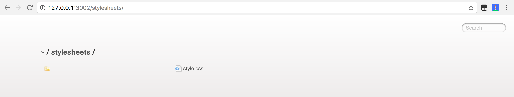

# webserver: html && publc

## 静态server

- apache(LAMP之a)
- nginx(LNMP之n)

每个http server framework里都内置的，虽然以后不会用

## express static

```
var express  = require('express');
var app      = express();
var path     = require('path');
var open     = require("open");

app.use(express.static(path.join(__dirname, 'www/')));

app.get('/', function (req, res) {
  res.send('Hello World')
})

// 随机端口3000 - 10000 之间
app.listen(4001)

open("http://127.0.0.1:4001");
```

## serve-static

基于connect的中间件

- [Serve static files](https://www.npmjs.com/package/serve-static)

代码

```
var finalhandler = require('finalhandler')
var http = require('http')
var serveStatic = require('serve-static')
 
// Serve up public/ftp folder 
var serve = serveStatic('public', {'index': ['index.html', 'index.htm']})
 
// Create server 
var server = http.createServer(function onRequest (req, res) {
  serve(req, res, finalhandler(req, res))
})
 
// Listen 
server.listen(3000)
```

- 安装依赖finalhandler && serve-static
- 创建public目录
- 创建index.html
- 启动这个静态服务器

## serve-index

基于connect的中间件

- [Serve directory listings](https://www.npmjs.com/package/serve-index)

```
var finalhandler = require('finalhandler')
var http = require('http')
var serveIndex = require('serve-index')
var serveStatic = require('serve-static')
 
// Serve directory indexes for public/stylesheets folder (with icons) 
var index = serveIndex('public/', {'icons': true})
 
// Serve up public/ftp folder files 
var serve = serveStatic('public')
 
// Create server 
var server = http.createServer(function onRequest(req, res){
  var done = finalhandler(req, res)
  serve(req, res, function onNext(err) {
    if (err) return done(err)
    index(req, res, done)
  })
})
 
// Listen 
server.listen(3002)
```



## 实现一个简单的网页

- 创建html
- 创建css和js和images目录
- 完成hello world

## open

```
var express  = require('express');
var app      = express();
var path     = require('path');
var open     = require("open");

app.get('/', function (req, res) {
  res.send('Hello World')
})

// 随机端口3000 - 10000 之间
app.listen(4001)

open("http://127.0.0.1:4001");
```

## 其他

nodejs里可以使用更简单的办法完成这事儿

```
npm i -g http-server

http-server . -p 8080 -o
```
