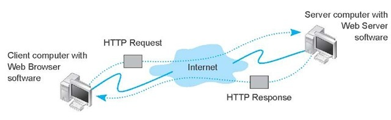

# intro

在 Node.js
web开发社区有一件事是确定的，有2个经常用于构建新的web应用的库，它们分别是connect
和express。

- [Connect是底层工具](http://www.senchalabs.org/connect/) 让你可以使用http协议或者其他网络协议进行会话。更简单点说，它提供的是筒子式插件机制，为http编码提供了一定的扩展性。
- [Express让构建好的网站更加简单](http://expressjs.com/)
，而且它是构建于Connect库之上的，也就是说它继承了筒子式插件机制，并且它扩展了路由、视图等概念，让http编码更加简单。

整体来看，这2个框架都还比较简单，甚至可以说是一个库而已。做个简单的服务还是够的，如果期望它做更多，可能需要自己封装了。

## 为什么使用和学习Express？

- 基于node的异步，性能比较好
- Express本身比较成熟，目前已经是v4了
- 有很多大规模应用实例，集群等都非常容易

以下是主要内容

- helloworld
- app.js
- public
- routes
- view
- auto mount routes
- reload
- test

## 无状态的http协议

