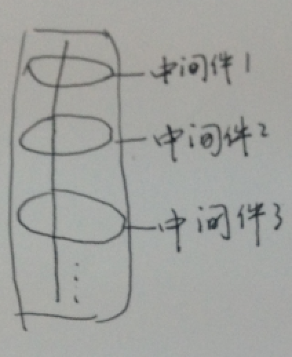
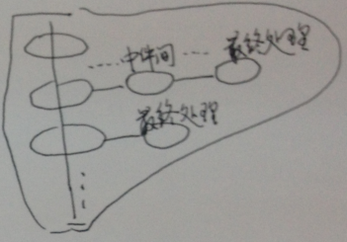

# middleware

## 中间件

```
function middleware(req, res, next) {
  // req.url starts with "/foo"
  res.end('Hello from Connect2!\n');
}
```

说明

- req是请求
- res是响应
- next是如果当前中间件不处理，就让下一个中间件处理

## 筒子理论

connect里

```
var connect = require('connect')
var http = require('http')

var app = connect()

// respond to all requests
app.use(function(req, res){
  res.end('Hello from Connect!\n');
})

app.use('/2', function fooMiddleware(req, res, next) {
  // req.url starts with "/foo"
  res.end('Hello from Connect2!\n');
});

//create node.js http server and listen on port
http.createServer(app).listen(3011)
```




## 变胖的筒子

express对某个中间件的筒子变胖理论

```
var express  = require('express');
var app      = express();

function m1(req, res) {
  console.log('m1...');
}

function m2(req, res) {
  console.log('m2...');
}

app.get('/', m1, m2, function (req, res) {
  res.send('Hello World')
})

// 随机端口3000 - 10000 之间
app.listen(4001)
```

在这个请求定义中，使用了m1和m2中间件，他们都没有处理具体内容，直接next下一个中间件去处理，即最后的那个匿名函数。



## 中间件分类：全局和路由里的

```
var express  = require('express');
var app      = express();

app.use(function (req, res, next) {
  res.send('global middleware....')
})

function m1(req, res) {
  console.log('m1...');
}

function m2(req, res) {
  console.log('m2...');
}

app.get('/', m1, m2, function (req, res) {
  res.send('Hello World')
})

// 随机端口3000 - 10000 之间
app.listen(4001)
```

- 全局的，出自connect（筒子）
- 路由里的，出自express（变胖的筒子）

## 总结


- 空项目
- connect的筒子理论
- express对某个中间件的筒子变胖理论
