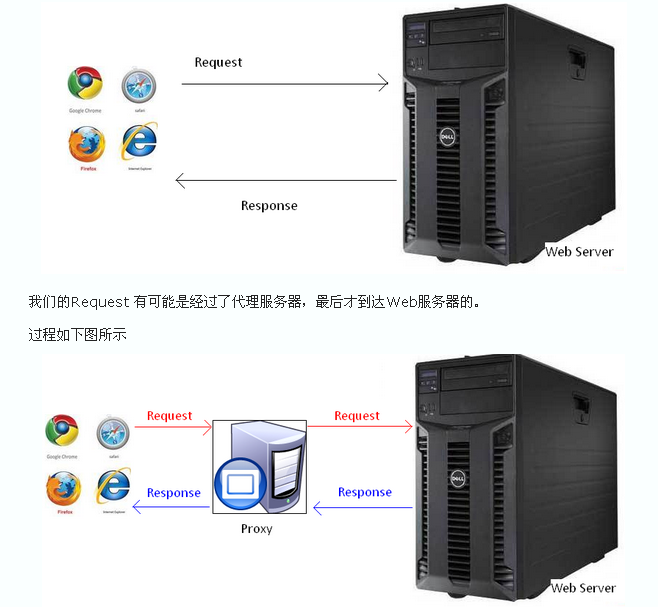

# minimal http

## b/s和c/s架构

- b/s= browser/server
- c/s= client/server

目前我们最常见的开发都是b/s架构的，也就是都是基于浏览器和服务器交互的、采用http协议的瘦应用

nodejs做为新兴平台，自然在这方面也提供了较好支持。nodejs的http部分相对比较完善，足矣满足绝大多数应用使用，而且又有nodejs本身的事件异步机制，它天生并发就比较高，和其他语言比较

- js语法简单
- 开发速度快
- 在不优化的情况下就会比java、php等其他语言高效
- 部署和运维也相对简单

综上，已经有非常多公司采用nodejs作为它们的后端技术栈。

## 科普：无状态的http协议

HTTP协议（HyperText Transfer Protocol，超文本传输协议）是用于从WWW服务器传输超文本到本地浏览器的传送协议。

它可以使浏览器更加高效，使网络传输减少。

它不仅保证计算机正确快速地传输超文本文档，还确定传输文档中的哪一部分，以及哪部分内容首先显示(如文本先于图形)等。

HTTP是一个应用层协议，由请求和响应构成，是一个标准的客户端服务器模型。

HTTP是一个无状态的协议。

## 科普request和response

大家都明白，Web应用抽象起来就是客户端发出请求，请求到达服务器后，服务器经过一番捣鼓，给客户端发回一个应答。“请求”我们一般抽象成 request，“应答”是 response。服务器和客户端（一般也就是浏览器啦，但是绝不局限于浏览器哦。）之间交流的语言就是 HTTP 协议了。至于服务器怎么折腾出一个应答来的，就八仙过海，各显神通了。

总之，Web 应用中两个重量级的东东就是： Request ， Response 。

前面我们说到，每次有访问进来，我们的代码都会跑一遍。

现在的问题是，在我们的代码里，怎么抓到客户端发来的 request , 然后，到哪里去找这个 response ，好把我们捣鼓出来的东西放进去，发给客户端呢？

答案是，只要我们把他们作为参数交给 tellme 函数(你可以给这个函数取任何名字甚至不给他名字)，然后，当请求到达时，node.js 就会把客户的请求封装成 request ，预备发给客户的应答封装成 response 。

我们拿到 request ，看看他请求些什么，再折腾些东西（读出个文件也好，去查数据库也好，随便你了。）丢进 response ，发给客户端。



更多见http://i5ting.github.io/node-http/


## Write a http server use Nodejs

```
var http = require('http');

http.createServer(function(request,response){
    console.log(request);
    response.end('Hello world!');
}).listen(8888);
```

这就是最简单的实现

如果要是根据不同url去处理呢？

```
var http = require('http');

http.createServer(function(req, res){
    console.log(req);

    if(req.url =='/'){
      res.end('Hello world!');
    }else if(req.url =='/2'){
      res.end('Hello world!2');
    }else{
      res.end('Hello world! other');
    }
}).listen(8888);
```

如果成百上千、甚至更多http服务呢？这样写起来是不是太low了，肯定要封装一下，让它更简单。

connect就是这样的一个框架，下面我们看一下

## 如何调试

node-inspector

- 本地可以
- Coding WebIDE不可以

第一步

```
npm i -g node-inspector   
```

第二步

```
node-debug hello.js 
```

第三步

打开http://127.0.0.1:8080/?ws=127.0.0.1:8080&port=5858 

## Write a http server  use Node connect

Connect is an extensible HTTP server framework for node using "plugins" known as middleware.

- extensible是可扩展的
- HTTP server framework是http服务端框架
- using "plugins" known as middleware即使用插件机制，就是大家常说的中间件

### 先看一下helloworld

```
var connect = require('connect')
var http = require('http')

var app = connect()

// respond to all requests
app.use(function(req, res){
  res.end('Hello from Connect!\n');
})

//create node.js http server and listen on port
http.createServer(app).listen(3011)
```

http://127.0.0.1:3011/


回想一下上一节中的http的例子

```
http.createServer(function(request,response){
    ...
}).listen(8888);
```

与

```
var app = connect()

// respond to all requests
app.use(function(req, res, next){
  ...
})

//create node.js http server and listen on port
http.createServer(app).listen(3011)
```

说明

- 都是http.createServer
- 差异是createServer的参数独立出去了，并且在connect里通过app.use方法可以挂在多个插件式的中间件

编程上有区分可变和不可变状态，可变的抽取出去，不可变的就固化好即可。connect做的就是提供了可变部分的插件化。

### 多url处理

好，我们再看一下它如何出个多个url情况

- /
- /2

connect2.js

```
var connect = require('connect')
var http = require('http')

var app = connect()

app.use('/2', function fooMiddleware(req, res, next) {
  // req.url starts with "/foo"
  res.end('Hello from Connect2!\n');
});

// respond to all requests
app.use(function(req, res){
  res.end('Hello from Connect!\n');
})

//create node.js http server and listen on port
http.createServer(app).listen(3011)
```

访问http://127.0.0.1:3011/2 看看能否访问？

上面讲了，connect实际上是将开发中得可变部分抽象出来，通过app.use方法都挂载到app对象上，这样处理起来就非常简单、清晰了。

### 中间件顺序

下面我们看一下中间件顺序

connect2.js

```
var connect = require('connect')
var http = require('http')

var app = connect()

// respond to all requests
app.use(function(req, res){
  res.end('Hello from Connect!\n');
})

app.use('/2', function fooMiddleware(req, res, next) {
  // req.url starts with "/foo"
  res.end('Hello from Connect2!\n');
});

//create node.js http server and listen on port
http.createServer(app).listen(3011)
```

访问http://127.0.0.1:3011/2 看看能否访问？

答案是不能的，原因是第一个use里没有指定path，这时候它就响应了所有请求，根本不给第二use的机会，所以正确的写法是

```
app.use('/', function fooMiddleware(req, res, next) {
  // req.url starts with "/foo"
  res.end('Hello from Connect2!\n');
});

app.use('/2', function fooMiddleware(req, res, next) {
  // req.url starts with "/foo"
  res.end('Hello from Connect2!\n');
});

// respond to other requests
app.use(function(req, res){
  res.end('Hello from Connect!\n');
})
```

这其实和我们第一个http里写的if判断一样

```
if(req.url =='/'){
  res.end('Hello world!');
}else if(req.url =='/2'){
  res.end('Hello world!2');
}else{
  res.end('Hello world! other');
}
```

这样的写法是不是很讨厌？顺序都要思考，弄死人了，这其实就是很多人埋怨nodejs坑多的原因之一，是真的有问题，还是自己没有弄明白呢？

总结一下，我们能得出什么结论呢？

- use的中间件有顺序
- 中间件分类：全局和路由里的
- 中间件定义


## Express

### helloworld

```
var express  = require('express');
var app      = express();

app.get('/', function (req, res) {
  res.send('Hello World')
})

// 随机端口3000 - 10000 之间
app.listen(4001)
```

### 多url处理

```
var express  = require('express');
var app      = express();

app.get('/', function (req, res) {
  res.send('Hello World')
})

app.get('/2', function (req, res) {
  res.send('Hello World2')
})

// 随机端口3000 - 10000 之间
app.listen(4001)
```


## 总结一下

- connect的helloworld
- connect多url处理方式
- connect中间件顺序
- 最后讲了一下中间件
