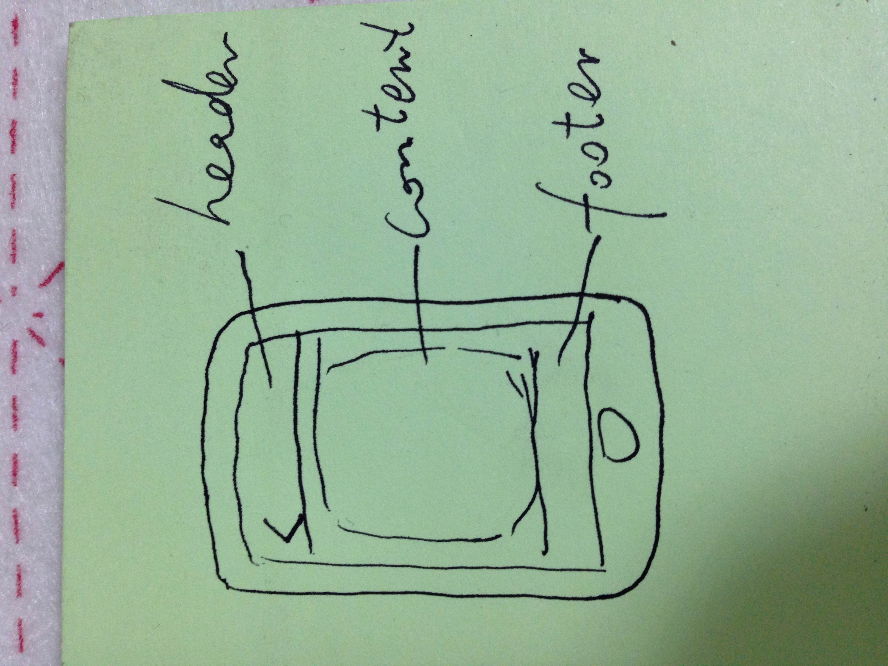
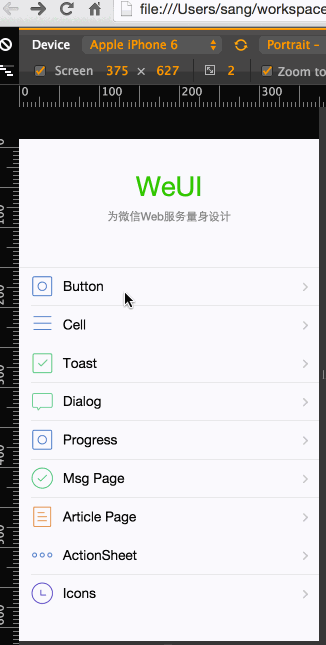
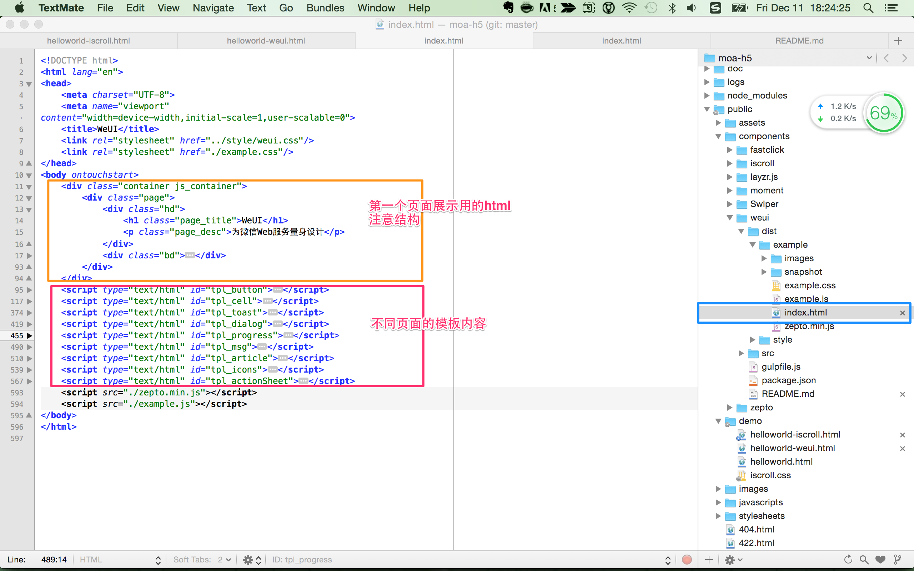
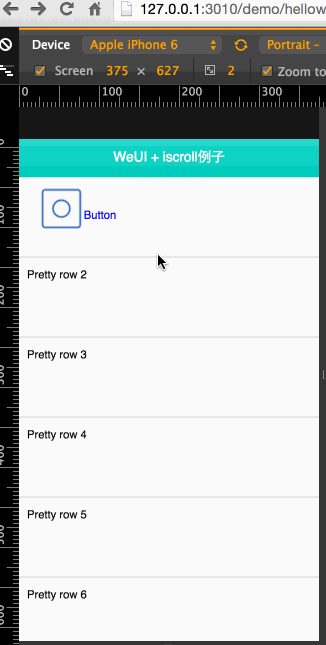

# 视频

- 解释一下视频问题
- 关于后面讲的问题


## 使用bower

- .bowerrc
- bower.json

bower install --save weui
bower install --save iscroll
bower install --save fastclick
bower install --save zepto
bower install --save layzr.js
bower install --save swiper 
bower install --save animate.css
bower install --save momentjs


layer.mobile只能自己下载


wget http://res.layui.com/download/layer.mobile-v1.7.zip

## 移动端抽象

几乎所有的页面都是这样的



- header
- content
- footer

## iscroll

http://cubiq.org/iscroll-5

它是什么？

- 模拟原生滚动小姑

它能干什么？

- 表格滚动
- 下拉刷新
- 图片左右滑动展示

### 版本说明

针对iScroll的优化。为了达到更高的性能，iScroll分为了多个版本。你可以选择最适合你的版本。
目前我们有以下版本：

- iscroll.js，这个版本是常规应用的脚本。它包含大多数常用的功能，有很高的性能和很小的体积。
- iscroll-lite.js，精简版本。它不支持快速跳跃，滚动条，鼠标滚轮，快捷键绑定。但如果你所需要的是滚动(特别是在移动平台) iScroll 精简版 是又小又快的解决方案。
- iscroll-probe.js，探查当前滚动位置是一个要求很高的任务,这就是为什么我决定建立一个专门的版本。如果你需要知道滚动位置在任何给定的时间,这是iScroll给你的。（我正在做更多的测试,这可能最终在常规iscroll.js脚本，请留意）。
- iscroll-zoom.js，在标准滚动功能上增加缩放功能。
- iscroll-infinite.js，可以做无限缓存的滚动。处理很长的列表的元素为移动设备并非易事。 iScroll infinite版本使用缓存机制,允许你滚动一个潜在的无限数量的元素。

特别熟的时候在考虑使用定制版本


打开demo/simple

### html
copy html

```
<div id="header">iScroll</div>

<div id="wrapper">
	<div id="scroller">
		<ul>
			<li>Pretty row 1</li>
        ...
			<li>Pretty row 50</li>
		</ul>
	</div>
</div>

<div id="footer"></div>
```

记住#wrapper，它是核心

### css

另外就是css，把里面的css都copy到iscroll.css里，在html里引入即可

### js

```
<script type="text/javascript">

var myScroll;

function loaded () {
	myScroll = new IScroll('#wrapper', { mouseWheel: true });
}

document.addEventListener('touchmove', function (e) { e.preventDefault(); }, false);

</script>
```

调用方式

```
<body onload="loaded()">
```

改成zepto的domready里

```
$(function(){
  alert('dom ready');
  loaded () ;
});
```

这样就完成了基本操作

http://127.0.0.1:3010/demo/helloworld-iscroll.html


### 关于selector

iscroll.js 249行

```
this.wrapper = typeof el == 'string' ? document.querySelector(el) : el;
```

### iscroll默认屏蔽了部分点击事件

比如你在#wrapper内部放a标签或button的click事件是绑定补上的。需要配置

```
myScroll = new IScroll('#wrapper', { 
  mouseWheel: true,
  click: true
});
```

### 其他选项和事件回调

选项和方法

- 各种动画，外观，滚动条等
- 下拉刷新
- 无限滚动
- 分页indicator
- 跳转到某页

事件回调（用生命周期去理解）

- beforeScrollStart，在用户触摸屏幕但还没有开始滚动时触发。
- scrollCancel，滚动初始化完成，但没有执行。
- scrollStart，开始滚动
- scroll，内容滚动时触发，只有在scroll-probe.js版本中有效，请参考onScroll event。
- scrollEnd，停止滚动时触发。
- flick，用户打开左/右。
- zoomStart，开始缩放。
- zoomEnd，缩放结束。

对比一下[jquery插件](https://github.com/i5ting/i5ting.jquery.tab/blob/master/example/index.html)

```
$('.wrap1').i5ting_jquery_tab({
	fix_height :'200px',
	tab_changed:function(current_index){
		console.log(current_index);
	}
});
```

### 总结

- html
- css
- js

## weui

WeUI是一套同微信原生视觉体验一致的基础样式库，由微信官方设计团队为微信 Web 开发量身设计，可以令用户的使用感知更加统一。包含button、cell、dialog、 progress、 toast、article、icon等各式元素。

严格的讲它是一个css库。算一个精简的库

```
<!DOCTYPE html>
<html lang="en">
    <head>
        <meta charset="UTF-8">
        <meta name="viewport" content="width=device-width,initial-scale=1,user-scalable=0">
        <title>WeUI</title>
        <link rel="stylesheet" href="path/to/weui/dist/style/weui.min.css"/>
    </head>
    <body>

    </body>
</html>
```

但它的demo里提供了不少好东西

打开weui/examples/index.html就可以演示效果



- 模板是加载，替换了常规的ajax（页面少的时候是个好办法）
- 实现了container里的显示隐藏效果
- pushstate改变url

结构

- container
  - page1
  - page2
  
看一下代码结构



### helloworld

copy 

```
<div class="container js_container">
  ...
</div>
```

预览一下效果，看到图片都未展示，于是把example里的images放到public/images下

此时预览，发现图片特别大，这肯定是css没有加载，于是把example.css放到public/demo下
改名为myweui.css

在html里引入即可

```
<link rel="stylesheet" href="./myweui.css" />
```

此时预览就可以了。此例用于测试样式是足够的，是为helloworld1

可是我如何点击，进入下一页呢

### 多页操作

把之前例子的

```
    <script type="text/html" id="tpl_button">
        <div class="page">
            <div class="hd">
                <h1 class="page_title">Button</h1>
            </div>
            <div class="bd spacing">
                <a href="javascript:;" class="weui_btn weui_btn_primary">按钮</a>
                <a href="javascript:;" class="weui_btn weui_btn_disabled weui_btn_primary">按钮</a>
                <a href="javascript:;" class="weui_btn weui_btn_warn">确认</a>
                <a href="javascript:;" class="weui_btn weui_btn_disabled weui_btn_warn">确认</a>
                <a href="javascript:;" class="weui_btn weui_btn_default">按钮</a>
                <a href="javascript:;" class="weui_btn weui_btn_disabled weui_btn_default">按钮</a>
                <div class="button_sp_area">
                    <a href="javascript:;" class="weui_btn weui_btn_plain_default">按钮</a>
                    <a href="javascript:;" class="weui_btn weui_btn_plain_primary">按钮</a>

                    <a href="javascript:;" class="weui_btn weui_btn_mini weui_btn_primary">按钮</a>
                    <a href="javascript:;" class="weui_btn weui_btn_mini weui_btn_default">按钮</a>
                </div>
            </div>
        </div>
    </script>
```

放到.container下面，这样就定义了模板

此时点击button按钮是不会有显示的。

那么我再找找例子里，是不是少什么东西?

把example.js放到public/demo下，改名为myweui.js

引入

```
    <script src="./myweui.js"></script>
```

此时刷新就好了。

也就是说所有的东西都在这个js里，我们之前说的pushstate、各种效果等都在这里

看一下按钮是如何定义和响应的

```
<a class="weui_cell js_cell" href="javascript:;" data-id="button">
    <span class="weui_cell_hd">
      </span>
    <div class="weui_cell_bd weui_cell_primary">
        <p>Button</p>
    </div>
    <div class="weui_cell_ft">
    </div>
</a>
```

- class="weui_cell js_cell"
- data-id="button"

这样就行了？

我们看一下myweui.js

```
$(function () {
```

这很明显是zeptojs写法

```
// page stack
var stack = [];
var $container = $('.js_container');
$container.on('click', '.js_cell[data-id]', function () {
    var id = $(this).data('id');
    go(id);
});
```

头几行，定义了一个stack，我们想一下那个推进来的效果，

- 默认显示，为栈的第一个元素
- 如果push进来就，stack里push一个，设置为当前显示的
- 如果点击返回呢，stack里pop出去最后一个，设置上一个为显示的
- 如果返回了栈顶，点返回就没效果了

这里的click事件，它的事件是.js_cell[data-id]

也就是class=js_cell，并且有data-id属性。

对比一下button的按钮

```
<a class="weui_cell js_cell" href="javascript:;" data-id="button">
```

如此，大概你就该明白了。

那么事件里面是

```
var id = $(this).data('id');
go(id);
```

就用button这个例子讲，这个id应该是data-id="button"里的button，对吧？

然后go就跳转了，也就是push的效果应该是它弄的

```
function go(id){
    var $tpl = $($('#tpl_' + id).html()).addClass('slideIn').addClass(id);
    $container.append($tpl);
    stack.push($tpl);
    // why not use `history.pushState`, https://github.com/weui/weui/issues/26
    //history.pushState({id: id}, '', '#' + id);
    location.hash = '#' + id;

    $($tpl).on('webkitAnimationEnd', function (){
        $(this).removeClass('slideIn');
    }).on('animationend', function (){
        $(this).removeClass('slideIn');
    });
    // tooltips
    if (id == 'cell') {
        $('.js_tooltips').show();
        setTimeout(function (){
            $('.js_tooltips').hide();
        }, 3000);
    }
}
```

看一下源码

- $container.append($tpl);是dom元素插入
- stack.push($tpl); 视图栈压入最新的
- location.hash = '#' + id;是pushstate更改url地址
- 其他就是动画或者根据id干点坏事了

稍微注意一下：我们push的页面从哪里来的？

```
var $tpl = $($('#tpl_' + id).html()).addClass('slideIn').addClass(id);
$container.append($tpl);
```

我们知道id是data-id="button"里的button，也就是说我们要根据id=“tpl_button”来找模板里的html。

想想我们之前是不是拷贝了一个这样的模板？

ok，只要是class=js_cell，并且有data-id属性的就会触发点击时间，根据tpl_button里的内容显示（push）。


这是push，那么返回pop呢？

```
// location.hash = '#hash1' 和点击后退都会触发`hashchange`，这个demo页面只关心后退
$(window).on('hashchange', function (e) {
    if (/#.+/gi.test(e.newURL)) {
        return;
    }
    var $top = stack.pop();
    if (!$top) {
        return;
    }
    $top.addClass('slideOut').on('animationend', function () {
        $top.remove();
    }).on('webkitAnimationEnd', function () {
        $top.remove();
    });
});
```

location.hash变了

- var $top = stack.pop();很明显出栈了
- if (!$top) {return;} 是如果栈顶，不做操作
- 然后处理$top，然后出栈的视图移除掉

最外面的视图移除了，很明显就是上一个视图显示了。

so，原理就是这么简单


时间有限，视图和其他点击事件控件的演示就不讲了

### weui的缺点

weui的优点

- 它很好的解决推入和返回的问题
- 它有微信一样的ui界面
- 它还提供了基本的ui组件（弹出框，actionsheet等）

那么它的缺点呢？页面内容过长的时候，滑动不流畅，以为它就没解决这个问题呢

这不正是iscroll解决的问题么？

如果weui加上iscroll的特性，是不是就很棒了？

## 让weui和iscroll结婚


### 以weui2为蓝本

观察一下它的dom

```
    <div class="container js_container">
        <div class="page">
            <div class="hd">
                <h1 class="page_title">WeUI</h1>
                <p class="page_desc">为微信Web服务量身设计</p>
            </div>
            <div class="bd">
                
            </div>
        </div>
    </div>
```

结合我们之前讲的移动端特点

- header
- content（#wrapper）
- footer

也就是说我们可以这样做

```
<div class="container js_container">
    <div class="page">
        <div class="hd header">
            <h1 class="page_title">WeUI</h1>
        </div>
        <div class="bd" id="wrapper">
            
        </div>
        
        <div class="hd footer">
            <h1 class="page_title">WeUI</h1>
        </div>
    </div>
</div>
```

我们先把helloiscroll里的内容放进去


<h1 class="page_title">WeUI</h1>

去掉 class="page_title"

不能滑动，添加js就好了

```
  <script type="text/javascript">
    $(function(){
      // alert('dom ready');
      loaded () ;
    });
  
    var myScroll;

    function loaded () {
    	myScroll = new IScroll('#wrapper', { mouseWheel: true });
    }

    document.addEventListener('touchmove', function (e) { 
      e.preventDefault(); 
    }, false);
  
  </script>
```


修改iscroll2.css

```
#header {/*add*/
	position: absolute;
	z-index: 2;
	top: 0;
	left: 0;
	width: 100%;
	height: 45px;
	line-height: 45px;
	background: #CD235C;
	padding: 0;
	color: #eee;
	font-size: 20px;
	text-align: center;
	font-weight: bold;
}
#wrapper {
	position: absolute;
	z-index: 1;
	top: 48px;/*m*/
	bottom: 0px; /*m*/
	left: 0;
	width: 100%;
	background: #ccc;
	overflow: hidden;
}
```

同时放到cell的高度

```
#scroller li {
	padding: 0 10px;
	height: 100px; /*m from 44 to 100*/
	line-height: 40px;
	border-bottom: 1px solid #ccc;
	border-top: 1px solid #fff;
	background-color: #fafafa;
	font-size: 14px;
}
```

下面开始集成点击进入按钮页面

看一下按钮是如何定义和响应的

```
<a class="weui_cell js_cell" href="javascript:;" data-id="button">
    <span class="weui_cell_hd">
      </span>
    <div class="weui_cell_bd weui_cell_primary">
        <p>Button</p>
    </div>
    <div class="weui_cell_ft">
    </div>
</a>
```

放到第一个li里


此时不能点击，nnd，这是怎么回事儿呢？

各位想想之前讲iscroll的时候，是不是有点注意事项啊？


比如你在#wrapper内部放a标签或button的click事件是绑定补上的。需要配置

```
myScroll = new IScroll('#wrapper', { 
  mouseWheel: true,
  click: true
});
```

翻查一下代码，确实没加click（其实是为了演示故意的）

加上，再次预览


很明显是z-index问题，翻查iscroll2.css里发现#wrapper是z-index:1

而.page没有设置,简单改一下即可


```
<style>
  .page{
    z-index: 2;
  }
</style>
```




### 是时候去加上weui其他效果了

- li上增加按钮
- 把对应模板引入

helloworld-weui2+iscroll2.html

## fastclick

这效果其实看起来已经不错了，足够留畅，也比较酷

但是点击按钮还是觉得有点慢，尤其是一些低端机上，回想上节讲的《事件：touch和click的区别》，似乎我们还能更完美

### 事件：touch和click的区别

在web里只有click，而移动端既有click又有touch，所以问题就来了

我怎么样区分它们呢？

三种在规范中列出并获得跨移动设备广泛实现的基本触摸事件：

1. touchstart ：手指放在一个DOM元素上。
1. touchmove ：手指拖曳一个DOM元素。
1. touchend ：手指从一个DOM元素上移开。

其实还有一个touchcancel

其实click也是touch，不过先识别一下，如果是touch就是touch，如果不是touch就当click处理。

结论肯定是touch反应比click快，所以移动的有一个比较好的实践

1. 使用zeptojs的tap的手势
1. 使用fastclick库

### 用法

https://github.com/ftlabs/fastclick

用法

```
FastClick.attach(document.body);
```

attach方法是给对应的selector增加快速点击事件，也就是把click转成touch。


简单封装

```
function add_fast_click(){
  if ('addEventListener' in document) {
      document.addEventListener('DOMContentLoaded', function() {
          FastClick.attach(document.body);
      }, false);
  }
}

add_fast_click();
```

## 框架编写

- 积累最佳事件
- 使用html编写基本demo
- 使用高级东西（比如less，coffee，jade）
- 持续抽象、完善

## 拔高：如何编写h5代码

见how-to-h5.md

## 作业

集成layer.mobile
