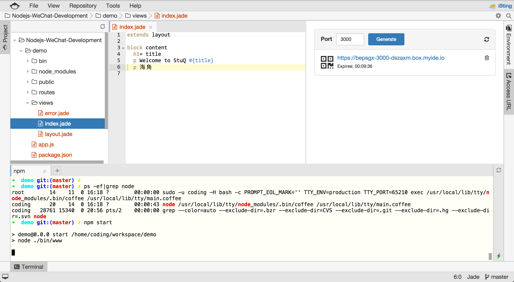

# express

## 安装express生成器

```
npm i -g express-generator
```

说明：

- npm是node package management
- install可简写i，是安装的意思
- global可简写-g，是全局安装的意思

安装之后

```
➜  workspace git:(i5ting) npm i -g express-generator
/home/coding/.nvm/versions/node/v4.2.2/bin/express -> /home/coding/.nvm/versions/node/v4.2.2/lib/node_modules/express-generator/bin/express
express-generator@4.13.1 /home/coding/.nvm/versions/node/v4.2.2/lib/node_modules/express-generator
├── sorted-object@1.0.0
├── commander@2.7.1 (graceful-readlink@1.0.1)
└── mkdirp@0.5.1 (minimist@0.0.8)
```

可以看出/home/coding/.nvm/versions/node/v4.2.2/bin/express是/home/coding/.nvm/versions/node/v4.2.2/lib/node_modules/express-generator/bin/express的软连接

另外/home/coding/.nvm/versions/node/v4.2.2/bin是在环境变量里的，也就是说express这个命令可以直接访问

## 初始化express项目

```
express demo

create : demo
create : demo/package.json
create : demo/app.js
create : demo/public
create : demo/routes
create : demo/routes/index.js
create : demo/routes/users.js
create : demo/public/javascripts
create : demo/public/stylesheets
create : demo/public/stylesheets/style.css
create : demo/views
create : demo/views/index.jade
create : demo/views/layout.jade
create : demo/views/error.jade
create : demo/public/images
create : demo/bin
create : demo/bin/www

install dependencies:
 $ cd demo && npm install

run the app:
 $ DEBUG=demo:* npm start
```

然后安装依赖模块

```
➜  test  cd demo
➜  demo  ls
app.js       bin          package.json public       routes       views
➜  demo  npm i
debug@2.2.0 node_modules/debug
└── ms@0.7.1

cookie-parser@1.3.5 node_modules/cookie-parser
├── cookie@0.1.3
└── cookie-signature@1.0.6

morgan@1.6.1 node_modules/morgan
├── on-headers@1.0.1
├── basic-auth@1.0.3
├── depd@1.0.1
└── on-finished@2.3.0 (ee-first@1.1.1)

serve-favicon@2.3.0 node_modules/serve-favicon
├── fresh@0.3.0
├── ms@0.7.1
├── etag@1.7.0
└── parseurl@1.3.0

body-parser@1.13.3 node_modules/body-parser
├── bytes@2.1.0
├── content-type@1.0.1
├── depd@1.0.1
├── on-finished@2.3.0 (ee-first@1.1.1)
├── qs@4.0.0
├── iconv-lite@0.4.11
├── http-errors@1.3.1 (statuses@1.2.1, inherits@2.0.1)
├── raw-body@2.1.4 (unpipe@1.0.0, iconv-lite@0.4.12)
└── type-is@1.6.9 (media-typer@0.3.0, mime-types@2.1.7)

express@4.13.3 node_modules/express
├── merge-descriptors@1.0.0
├── array-flatten@1.1.1
├── cookie@0.1.3
├── utils-merge@1.0.0
├── cookie-signature@1.0.6
├── methods@1.1.1
├── fresh@0.3.0
├── range-parser@1.0.3
├── escape-html@1.0.2
├── vary@1.0.1
├── path-to-regexp@0.1.7
├── content-type@1.0.1
├── etag@1.7.0
├── parseurl@1.3.0
├── serve-static@1.10.0
├── content-disposition@0.5.0
├── depd@1.0.1
├── finalhandler@0.4.0 (unpipe@1.0.0)
├── on-finished@2.3.0 (ee-first@1.1.1)
├── qs@4.0.0
├── type-is@1.6.9 (media-typer@0.3.0, mime-types@2.1.7)
├── proxy-addr@1.0.8 (forwarded@0.1.0, ipaddr.js@1.0.1)
├── accepts@1.2.13 (negotiator@0.5.3, mime-types@2.1.7)
└── send@0.13.0 (destroy@1.0.3, ms@0.7.1, statuses@1.2.1, mime@1.3.4, http-errors@1.3.1)

jade@1.11.0 node_modules/jade
├── character-parser@1.2.1
├── void-elements@2.0.1
├── commander@2.6.0
├── constantinople@3.0.2 (acorn@2.6.4)
├── mkdirp@0.5.1 (minimist@0.0.8)
├── with@4.0.3 (acorn-globals@1.0.9, acorn@1.2.2)
├── jstransformer@0.0.2 (is-promise@2.1.0, promise@6.1.0)
├── clean-css@3.4.8 (source-map@0.4.4, commander@2.8.1)
├── transformers@2.1.0 (promise@2.0.0, css@1.0.8, uglify-js@2.2.5)
└── uglify-js@2.6.1 (uglify-to-browserify@1.0.2, async@0.2.10, source-map@0.5.3, yargs@3.10.0)
```

然后启动服务器

```
npm start
```

如果没有报错，就是启动成功了。

此时还无法测试，需要设置Access URL（访问地址）




说明：

- 1）设置Port = 3000（因为bin/www里默认使用的是3000端口）
- 2）点击Generate生成具体url
- 3）点击下面的url地址，此时就会在浏览器里打开


