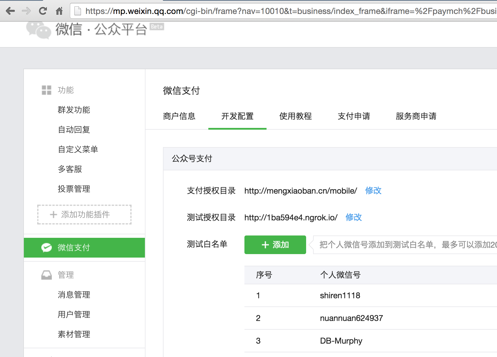

# 科普几个概念

公众号和支付是2个平台

所以我们需要准备2个地方

## 公众号相关

### app_id 和 app_secret

微信公众号的信息，在我们的微信分享那节就讲了


### 安全域名

一个月只有3次机会

## 微信支付平台

### 商户标识 mch_id

https://pay.weixin.qq.com/index.php/account/info


```
账户信息->基本账户信息
```

微信支付商户号


### partner_key

https://pay.weixin.qq.com/index.php/account/api_cert


```
API安全->API密钥
```

### p12文件

由微信支付签发给你用来标识和界定你的身份


步骤1

```
API安全->操作证书->安装操作证书
```


步骤2

```
API安全->API证书->下载证书
```

下载的文件cert.zip里，即apiclient_cert.p12。


### 原理

ssl加密，生成p12文件


可以参见【 导出pem证书给服务端Push Notification使用】http://blog.csdn.net/cooldragon/article/details/19404645


## 微信设置



- 公众号->微信支付->公众号支付->测试授权目录
- 公众号->开发者中心->网页服务->网页账号->网页授权获取用户基本信息

如果是产品模式，还要注意安全域名

测试授权目录说明

当前目录是 

- http://127.0.0.1:3000/contacts/new?activity_id=561cd060f96de2aee37f36b4

测试授权目录

- http://127.0.0.1:3000/contacts/

