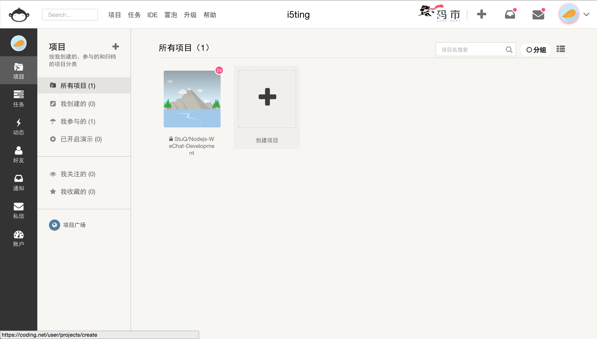
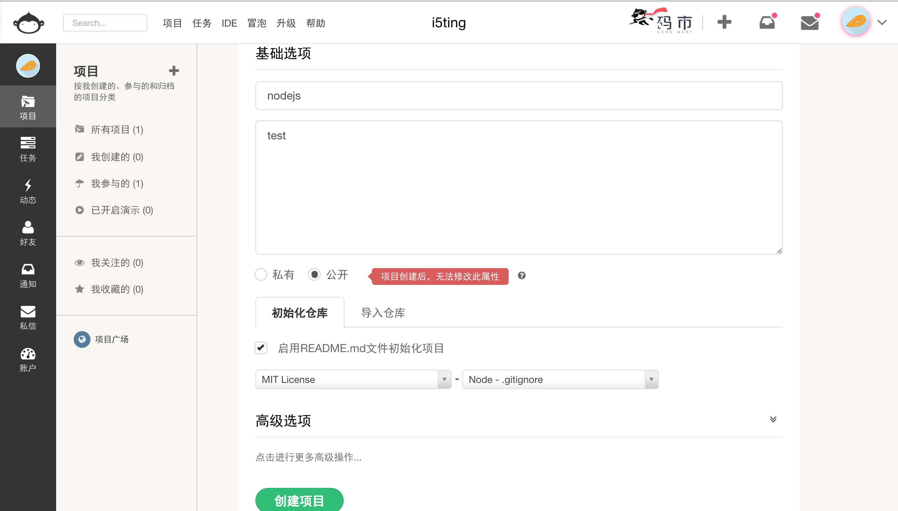
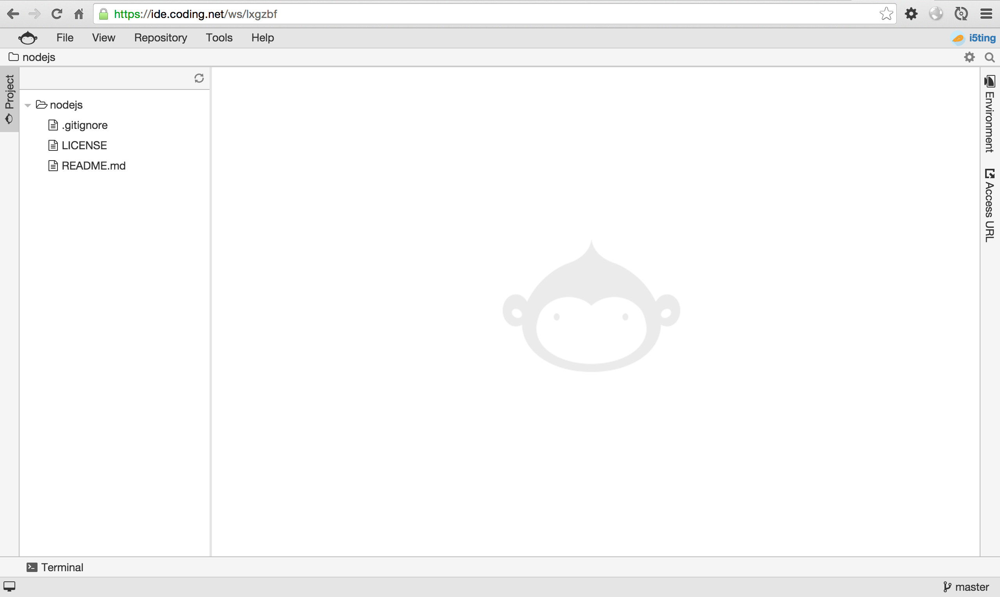
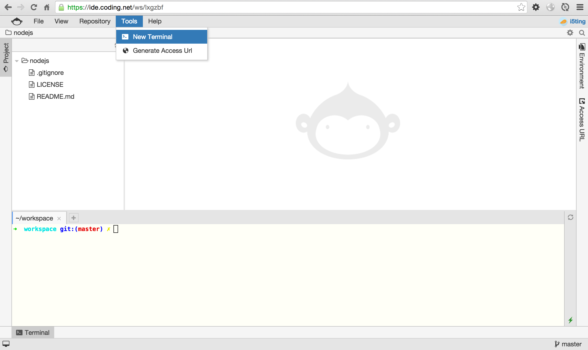
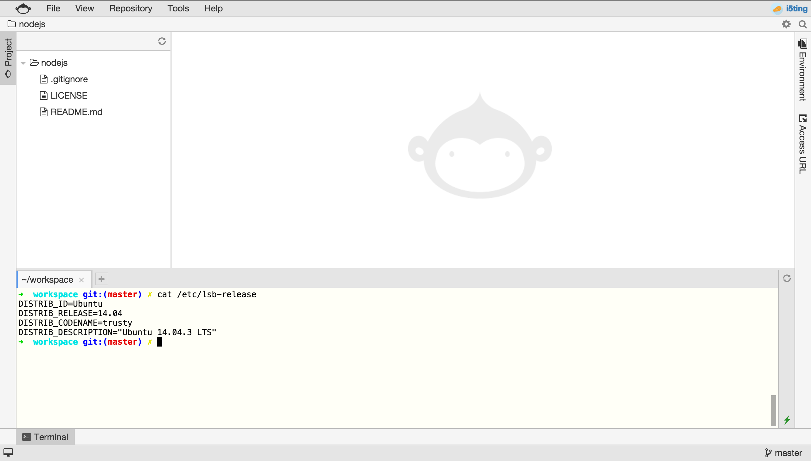
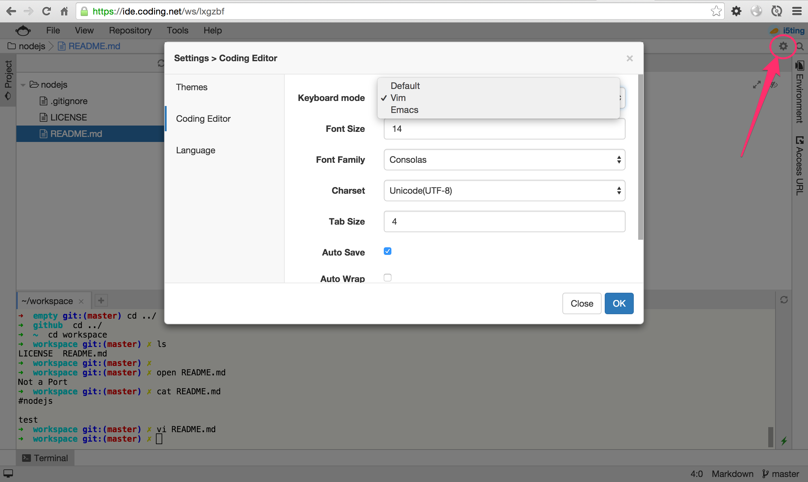
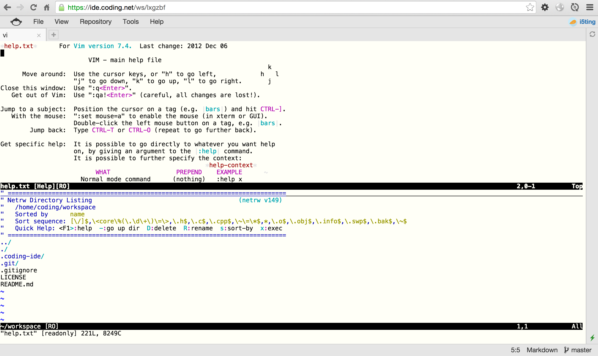

# Coding WebIDE

## 创建项目



填写项目信息



说明

- 选择启用README.md文件初始化项目
- 选择MIT作为开源协议
- 选择Node.gitignore

点击创建即可


## 个人项目里点击进入WebIDE

个人项目里点击选中WebIDE


进入界面如下



## 菜单栏选择，新建Terminal（终端）

```
Tools-> New Terminal
```



## 终端里查看操作系统信息

Terminal（终端）里键入命令

```
cat /etc/lsb-release
```



## 终端里练习git命令

具体操作

- git init
- 创建README.md
- add
- commit
- push

进阶

- github上创建项目
- git remote add xxx
- 分支

下面给出一些git学习资料

- [搬进 Github](http://gitbeijing.com/)
- [git-guide](http://www.bootcss.com/p/git-guide/)
- [git入门gif演示](https://git.oschina.net/wzw/git-quick-start)

## 编辑器设置 && 练习vim

可以自己练习一下vim



在终端里

```
vi .
```

进去后,先按一下esc，然后输入

```
:help
```



如果不懂,你可以百度搜vim中文手册或者买本书


