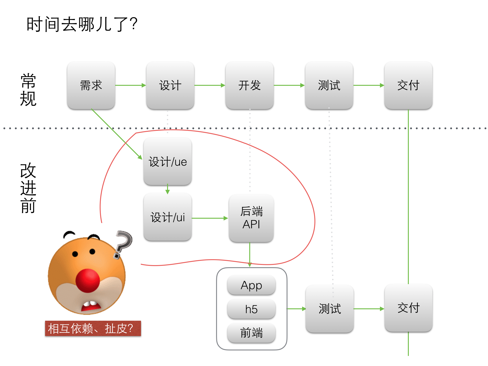
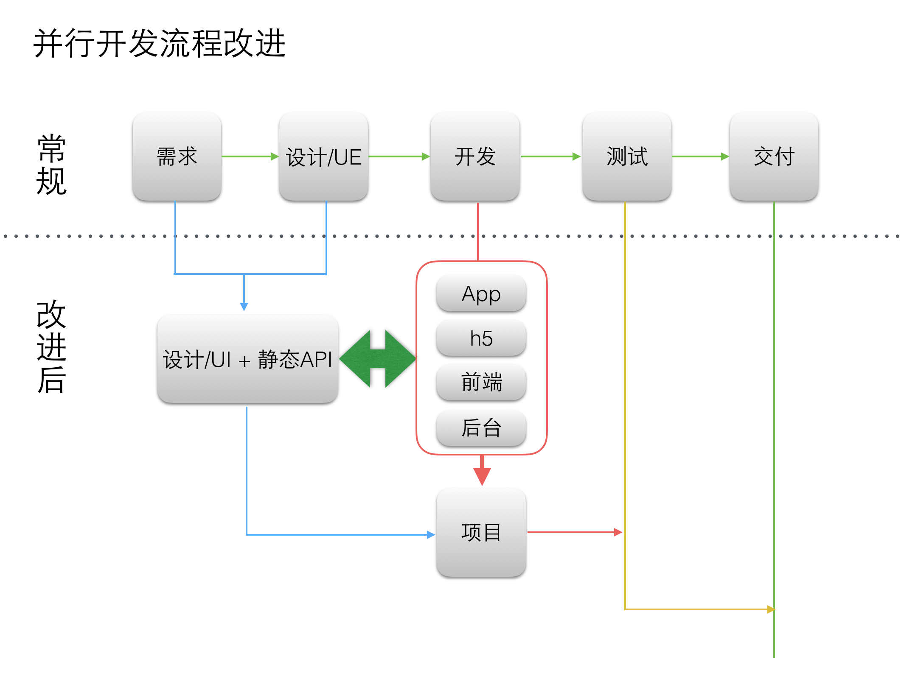

# 静态api

## Why？

开发流程

1. 需求（用户故事）
1. 交互
1. 静态api
1. 开发和ui并行
1. 测试、部署等






这里面可以看到交互ue出了，就可以出静态api

静态api好处

- 分析在前，定义好接口规范和字段等
- 有了静态api，开发也可以并行
  - 后端java/node/php
  - h5/pc
  - 移动端

如果再智能点，静态api是可以对线上api进行测试和压测的。

## 实现方法

### json-server

Get a full fake REST API with zero coding in less than 30 seconds (seriously)

https://github.com/typicode/json-server


Create a db.json file

```
{
  "posts": [
    { "id": 1, "title": "json-server", "author": "typicode" }
  ],
  "comments": [
    { "id": 1, "body": "some comment", "postId": 1 }
  ],
  "profile": { "name": "typicode" }
}
```

Start JSON Server

```
$ json-server --watch db.json
```

Now if you go to http://localhost:3000/posts/1, you'll get

```
{ "id": 1, "title": "json-server", "author": "typicode" }
```

### apie

https://github.com/base-n/apie


Features

- 代码极简，可配置api目录
- 支持路径和url映射,在routes目录下创建api目录，即可使用/api作为路径
- 支持v1或v2版本
- 使用express-style的路由，写法简单
- 使用res.api约定api返回格式
- 使用req.db(实际是lowdb)模拟数据

Teck Stacks

- use base2 as micro kernel
- use expess-style routes
- use res.api as api convention
- use nodemon for livereload


https://github.com/base-n/apie/blob/master/routes/api/index.js

```
var express     = require('express');
var router      = express.Router();

// console.dir(router)
/* GET home page. */
router.get('/', function(req, res, next) {
  res.api({a:1});
});

router.get('/error', function(req, res, next) {
  res.api_error({a:1});
});

module.exports = router;
```


## tpl

- url : http://127.0.0.1:3019/api/
- method : GET
- type : JSON
- params : 无
- 返回
  - 返回状态码
  - 返回字段说明

示例

获取课程列表

- url : http://127.0.0.1:3019/api/v1/lessions
- method : GET
- type : JSON
- params : 无
- 返回
  - 返回状态码
    - 0 成功
  - 返回字段说明
    - lessions 对象数组

## 课程api

- 获取课程列表
- 获取课程详情
- 创建订单
- 我的课程

大家试着补出一下
