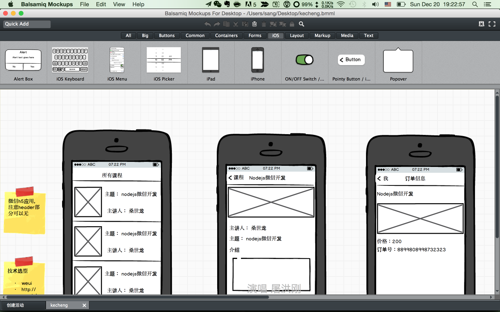
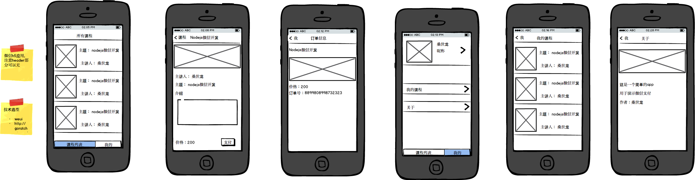
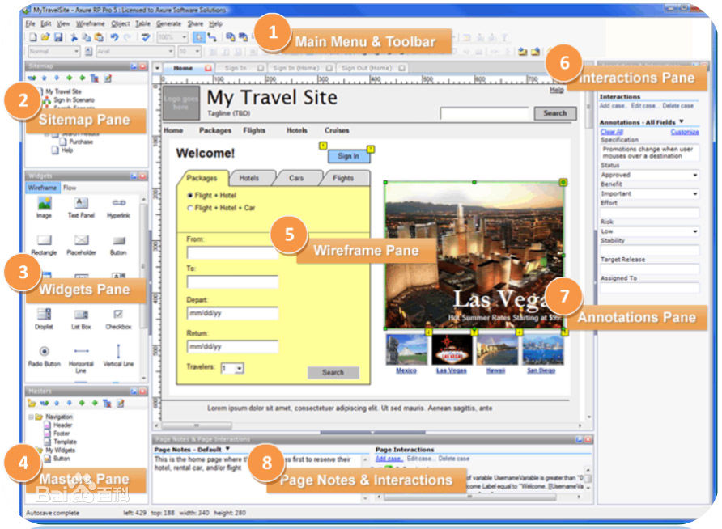

# ui/ue

当用户故事和场景确定了，此时就可以开始设计了

- 第一步是ue：出低保真原型图，确认交互
- 第二步是ui：出高保真设计图，切图交付给开发

一般我们是出了交互，就让【产品经理和交互设计师】给【设计和开发】讲解需求和交互，【设计和开发】基本可以并行，在设计未定稿前，开发可以技术调研、选型、建模，编写api等

## ue

- Balsamiq Mockups

下面是我设计的交互

- axure

## ui

- skech

Sketch中文网 http://www.sketchcn.com/

匡雪婷 http://www.aegeank.com/

叶老师的 https://github.com/hayeah/30-days-of-design

目前我的朋友在帮我弄，设计还没有出来
