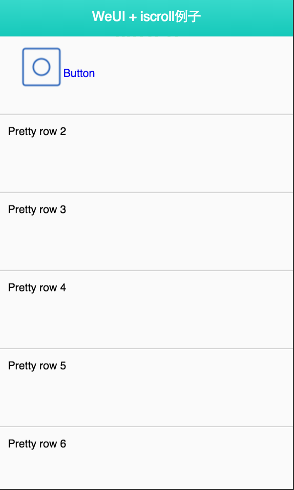
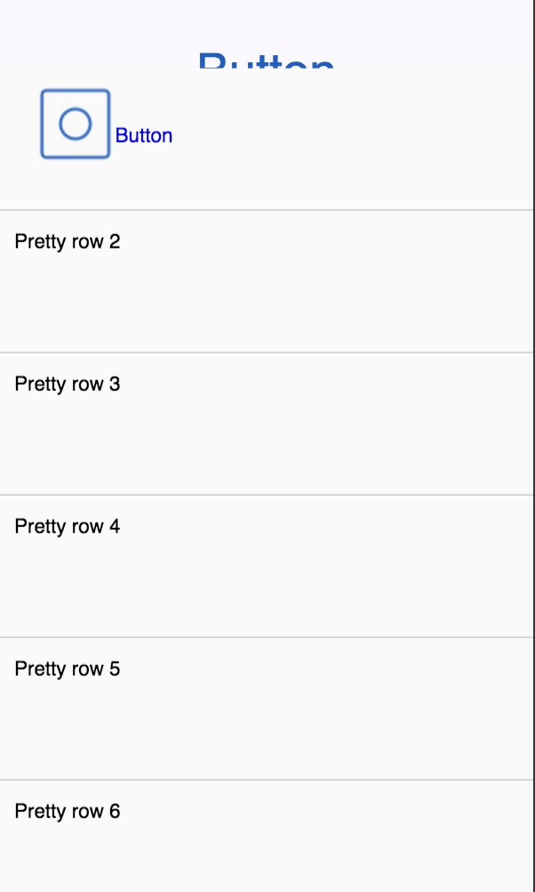
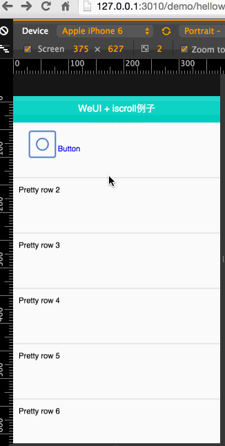

# 让weui和iscroll结婚


### 以weui2为蓝本

观察一下它的dom

```
    <div class="container js_container">
        <div class="page">
            <div class="hd">
                <h1 class="page_title">WeUI</h1>
                <p class="page_desc">为微信Web服务量身设计</p>
            </div>
            <div class="bd">
                
            </div>
        </div>
    </div>
```

结合我们之前讲的移动端特点

- header
- content（#wrapper）
- footer

也就是说我们可以这样做

```
<div class="container js_container">
    <div class="page">
        <div class="hd header">
            <h1 class="page_title">WeUI</h1>
        </div>
        <div class="bd" id="wrapper">
            
        </div>
        
        <div class="hd footer">
            <h1 class="page_title">WeUI</h1>
        </div>
    </div>
</div>
```

我们先把helloiscroll里的内容放进去


<h1 class="page_title">WeUI</h1>

去掉 class="page_title"

不能滑动，添加js就好了

```
  <script type="text/javascript">
    $(function(){
      // alert('dom ready');
      loaded () ;
    });
  
    var myScroll;

    function loaded () {
    	myScroll = new IScroll('#wrapper', { mouseWheel: true });
    }

    document.addEventListener('touchmove', function (e) { 
      e.preventDefault(); 
    }, false);
  
  </script>
```


修改iscroll2.css

```
#header {/*add*/
	position: absolute;
	z-index: 2;
	top: 0;
	left: 0;
	width: 100%;
	height: 45px;
	line-height: 45px;
	background: #CD235C;
	padding: 0;
	color: #eee;
	font-size: 20px;
	text-align: center;
	font-weight: bold;
}
#wrapper {
	position: absolute;
	z-index: 1;
	top: 48px;/*m*/
	bottom: 0px; /*m*/
	left: 0;
	width: 100%;
	background: #ccc;
	overflow: hidden;
}
```

同时放到cell的高度

```
#scroller li {
	padding: 0 10px;
	height: 100px; /*m from 44 to 100*/
	line-height: 40px;
	border-bottom: 1px solid #ccc;
	border-top: 1px solid #fff;
	background-color: #fafafa;
	font-size: 14px;
}
```

下面开始集成点击进入按钮页面

看一下按钮是如何定义和响应的

```
<a class="weui_cell js_cell" href="javascript:;" data-id="button">
    <span class="weui_cell_hd">
      </span>
    <div class="weui_cell_bd weui_cell_primary">
        <p>Button</p>
    </div>
    <div class="weui_cell_ft">
    </div>
</a>
```

放到第一个li里



此时不能点击，nnd，这是怎么回事儿呢？

各位想想之前讲iscroll的时候，是不是有点注意事项啊？


比如你在#wrapper内部放a标签或button的click事件是绑定补上的。需要配置

```
myScroll = new IScroll('#wrapper', { 
  mouseWheel: true,
  click: true
});
```

翻查一下代码，确实没加click（其实是为了演示故意的）

加上，再次预览



很明显是z-index问题，翻查iscroll2.css里发现#wrapper是z-index:1

而.page没有设置,简单改一下即可


```
<style>
  .page{
    z-index: 2;
  }
</style>
```




### 是时候去加上weui其他效果了

- li上增加按钮
- 把对应模板引入

helloworld-weui2+iscroll2.html
