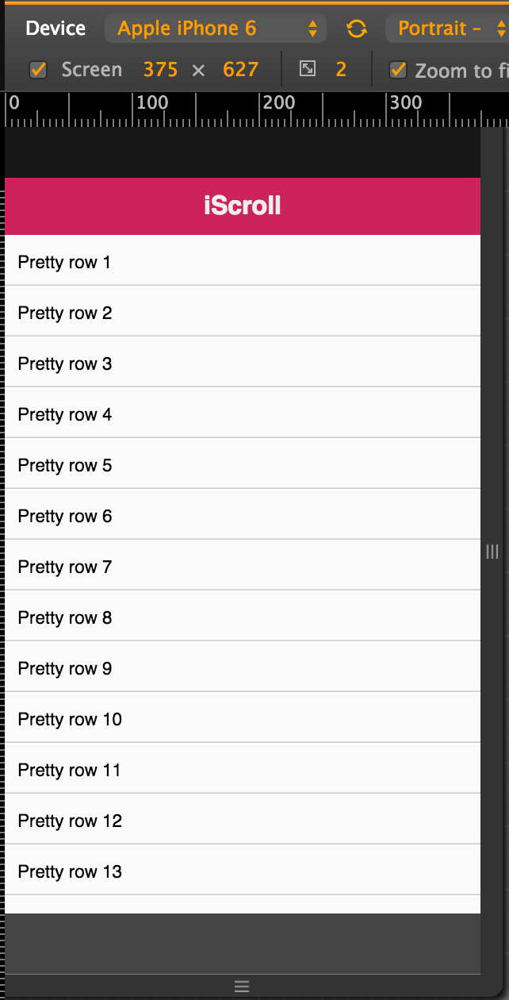

# iscroll

http://cubiq.org/iscroll-5

它是什么？

- 模拟原生滚动小姑

它能干什么？

- 表格滚动
- 下拉刷新
- 图片左右滑动展示

### 版本说明

针对iScroll的优化。为了达到更高的性能，iScroll分为了多个版本。你可以选择最适合你的版本。
目前我们有以下版本：

- iscroll.js，这个版本是常规应用的脚本。它包含大多数常用的功能，有很高的性能和很小的体积。
- iscroll-lite.js，精简版本。它不支持快速跳跃，滚动条，鼠标滚轮，快捷键绑定。但如果你所需要的是滚动(特别是在移动平台) iScroll 精简版 是又小又快的解决方案。
- iscroll-probe.js，探查当前滚动位置是一个要求很高的任务,这就是为什么我决定建立一个专门的版本。如果你需要知道滚动位置在任何给定的时间,这是iScroll给你的。（我正在做更多的测试,这可能最终在常规iscroll.js脚本，请留意）。
- iscroll-zoom.js，在标准滚动功能上增加缩放功能。
- iscroll-infinite.js，可以做无限缓存的滚动。处理很长的列表的元素为移动设备并非易事。 iScroll infinite版本使用缓存机制,允许你滚动一个潜在的无限数量的元素。

特别熟的时候在考虑使用定制版本


打开demo/simple

### html
copy html

```
<div id="header">iScroll</div>

<div id="wrapper">
	<div id="scroller">
		<ul>
			<li>Pretty row 1</li>
        ...
			<li>Pretty row 50</li>
		</ul>
	</div>
</div>

<div id="footer"></div>
```

记住#wrapper，它是核心

### css

另外就是css，把里面的css都copy到iscroll.css里，在html里引入即可

### js

```
<script type="text/javascript">

var myScroll;

function loaded () {
	myScroll = new IScroll('#wrapper', { mouseWheel: true });
}

document.addEventListener('touchmove', function (e) { e.preventDefault(); }, false);

</script>
```

调用方式

```
<body onload="loaded()">
```

改成zepto的domready里

```
$(function(){
  alert('dom ready');
  loaded () ;
});
```

这样就完成了基本操作

http://127.0.0.1:3010/demo/helloworld-iscroll.html





### 关于selector

iscroll.js 249行

```
this.wrapper = typeof el == 'string' ? document.querySelector(el) : el;
```

### iscroll默认屏蔽了部分点击事件

比如你在#wrapper内部放a标签或button的click事件是绑定补上的。需要配置

```
myScroll = new IScroll('#wrapper', { 
  mouseWheel: true,
  click: true
});
```

### 其他选项和事件回调

选项和方法

- 各种动画，外观，滚动条等
- 下拉刷新
- 无限滚动
- 分页indicator
- 跳转到某页

事件回调（用生命周期去理解）

- beforeScrollStart，在用户触摸屏幕但还没有开始滚动时触发。
- scrollCancel，滚动初始化完成，但没有执行。
- scrollStart，开始滚动
- scroll，内容滚动时触发，只有在scroll-probe.js版本中有效，请参考onScroll event。
- scrollEnd，停止滚动时触发。
- flick，用户打开左/右。
- zoomStart，开始缩放。
- zoomEnd，缩放结束。

对比一下[jquery插件](https://github.com/i5ting/i5ting.jquery.tab/blob/master/example/index.html)

```
$('.wrap1').i5ting_jquery_tab({
	fix_height :'200px',
	tab_changed:function(current_index){
		console.log(current_index);
	}
});
```

### 总结

- html
- css
- js
